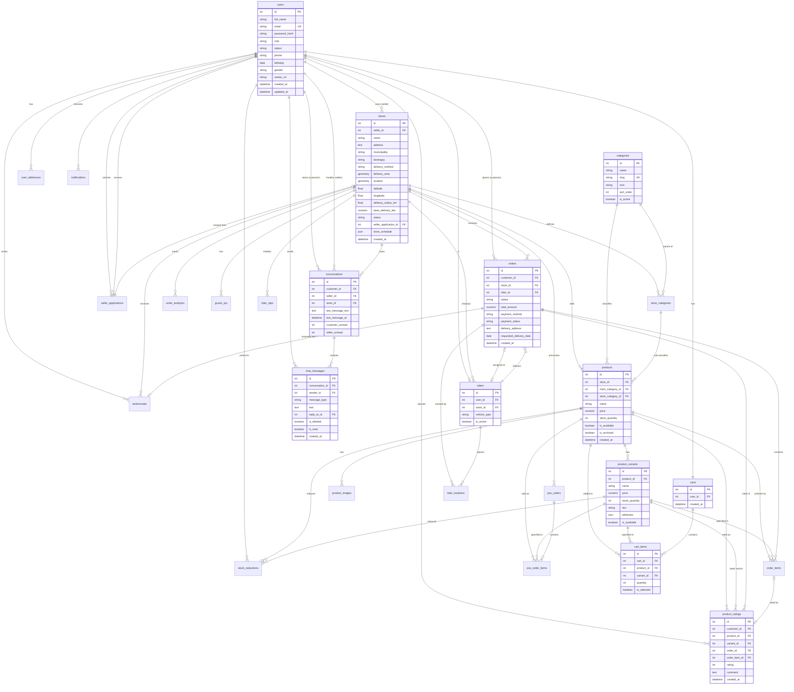

# eFlora System - ERD and Database Schema Documentation (Polished)

---

## Table of Contents

1. [Project Overview](#1-project-overview)
2. [ERD Overview](#2-erd-overview)
3. [Notation Justification](#3-notation-justification)
4. [Entity Relationship Diagram](#4-entity-relationship-diagram)
5. [Data Dictionary](#5-data-dictionary)
6. [Database Schema — Logical Design](#6-database-schema--logical-design)
7. [Database Schema — Physical Design](#7-database-schema--physical-design)
8. [Relationship Mapping](#8-relationship-mapping)
9. [Normalization](#9-normalization-analysis)
10. [Business Rules](#10-business-rules)
11. [Assumptions](#11-assumptions-and-limitations)
12. [Limitations](#12-data-integrity-and-constraints)
13. [Data Integrity and Validation](#13-performance-considerations)
14. [Performance Considerations](#14-data-flow-diagrams)
15. [Data Flow Consideration](#15-testing-and-validation)
16. [Testing Considerations](#16-references)

---

## 1. Project Overview

### 1.1 System Description

**eFlora** is a full-stack e-commerce platform for flower shops and related businesses located in Laguna, Philippines. The system enables local flower sellers to establish online storefronts, manage product inventories, process customer orders, coordinate delivery through rider assignments, and accept payments via GCash receipt image.

### 1.2 Technology Stack

| Layer | Technology |
|-------|-----------|
| **Backend** | Python 3 / Flask, SQLAlchemy ORM, Flask-JWT-Extended |
| **Database** | PostgreSQL 15+ with PostGIS extension (GeoAlchemy2) |
| **Frontend (Web)** | Jinja2 templates, JavaScript, HTML/CSS |
| **Frontend (Mobile)** | Flutter / Dart with Provider state management |
| **Image Storage** | Cloudinary (all images served via CDN) |
| **Deployment** | Railway (production), Docker |
| **Geospatial** | PostGIS (POLYGON, MULTIPOLYGON, POINT geometries with SRID 4326) |

### 1.3 System Actors (User Roles)

| Role | Description |
|------|-------------|
| **Customer** | Browses stores, adds products to cart, places orders, writes testimonials |
| **Seller** | Manages store profile, products, categories, orders, riders, POS transactions |
| **Rider** | Accepts delivery assignments, reports real-time location, uploads delivery proof |
| **Admin** | Reviews seller applications, approves/rejects stores, manages global categories, monitors analytics |

### 1.4 Core Business Modules

- **User & Authentication** — Registration, login, JWT-based session management, role-based access control
- **Seller Application Workflow** — Application submission → Admin review → Store creation upon approval
- **Store Management** — Store profile, schedule, delivery zone configuration (radius / drawn zone / municipality), GCash QR code management
- **Product Catalog** — Products with images, variants (size/color/stems), two-tier categorization (global category → store subcategory), archival
- **Shopping Cart** — Per-user cart with variant selection, item selection (checkbox), multi-store grouping
- **Order Processing** — Online orders with GCash payment proof, delivery scheduling, rider assignment, status lifecycle (pending → confirmed → preparing → out_for_delivery → delivered / cancelled)
- **Point-of-Sale (POS)** — In-store transactions with cash management, discounts
- **Delivery & Geospatial** — Three delivery area methods (radius, drawn zone, municipality polygon), Haversine distance calculation, delivery fee computation, rider GPS tracking
- **Reviews & Analytics** — Store testimonials, per-product ratings tied to completed orders, and daily order analytics aggregation
- **Customer-Seller Messaging** — Real-time conversation threads, chat messages, unread counters, read receipts, and media attachments

---

## 2. ERD Overview

### 2.1 Purpose

The Entity Relationship Diagram (ERD) provides a visual blueprint of the eFlora database by showing the entities, their key attributes, and the relationships that connect them. It serves as the primary reference for understanding data structure, foreign key dependencies, and cardinality constraints across the system. Beyond visualization, the ERD also supports system logic before implementation by clarifying ownership rules, order decomposition, optional versus mandatory participation, and where integrity constraints must be enforced in the application and database layers.

### 2.2 Scope

The ERD covers **27 entities** (database tables) organized into the following functional domains:

| Domain | Entities |
|--------|----------|
| **Identity & Access** | `users`, `notifications`, `user_addresses`, `carts`, `rider_otps` |
| **Seller Onboarding** | `seller_applications` |
| **Store Management** | `stores`, `gcash_qrs`, `municipality_boundaries` |
| **Product Catalog** | `categories`, `store_categories`, `products`, `product_images`, `product_variants` |
| **Transaction & Fulfillment** | `cart_items`, `orders`, `order_items`, `pos_orders`, `pos_order_items`, `stock_reductions` |
| **Delivery & Logistics** | `riders`, `rider_locations` |
| **Reviews & Analytics** | `testimonials`, `product_ratings`, `order_analytics` |
| **Communication** | `conversations`, `chat_messages` |

### 2.3 Entity Count Summary

- **Total Entities:** 27
- **Primary Associative Entities:** 4 (`store_categories`, `cart_items`, `order_items`, `pos_order_items`)
- **Audit Tables:** 1 (`stock_reductions`)
- **Analytics/Materialized Tables:** 1 (`order_analytics`)
- **Messaging Tables:** 2 (`conversations`, `chat_messages`)
- **Geospatial Reference Tables:** 1 (`municipality_boundaries`)

---

## 3. Notation Justification

### 3.1 Selected Notation: Crow's Foot (IE Notation)

This documentation uses **Crow's Foot notation** (also known as Information Engineering notation) for the ERD. This is the most widely adopted notation in industry and academic database design.

### 3.2 Reason for Choosing the Notation

Crow's Foot notation was selected because the eFlora schema is relationship-heavy and depends on clearly showing one-to-many, optional, and mandatory participation rules. The notation makes entities easy to read as table-like structures, keeps attributes visually grouped with their owning entity, and represents relationships in a way that matches how the database is implemented in SQLAlchemy and PostgreSQL.

### 3.3 Advantages of the Notation

The main advantage of Crow's Foot notation is that it communicates both structure and business meaning at a glance. Entities are represented as named rectangles, attributes are listed inside those entities, and relationships are represented by connecting lines whose endpoints indicate cardinality and optionality. A bar denotes mandatory participation, a circle denotes optional participation, and the crow's foot symbol denotes "many," allowing the reader to quickly identify whether a relationship is one-to-one, one-to-many, or optional.

### 3.4 Comparison with Other Notations

Compared with Chen notation, Crow's Foot is more compact and easier to apply to implementation-oriented documentation because relationships do not need separate diamond symbols and attributes remain close to the table they belong to. Chen notation is strong for conceptual teaching, but it becomes visually heavier in a schema with many operational entities such as carts, orders, riders, ratings, and chat records. UML class diagrams could also model the system, but they are better suited to object-oriented software structure than relational cardinality analysis. For this project, Crow's Foot provides the clearest bridge between conceptual design and the actual database schema.

### 3.5 Symbol Reference

| Symbol | Meaning |
|--------|---------|
| `\|\|` | Exactly one (mandatory) |
| `\|o` | Zero or one (optional) |
| `o{` | Zero or many |
| `\|{` | One or many |
| `PK` | Primary Key |
| `FK` | Foreign Key |
| `UK` | Unique Key |

---

## 4. Entity Relationship Diagram

### 4.1 Complete ERD



*(The diagram above is a condensed analytical view. Section 5 contains the fuller field-level dictionary.)*

### 4.2 Key Selection and Identification

The schema uses single-column surrogate primary keys (`id`) for every table because they simplify foreign key references, keep joins predictable, and avoid propagating wide composite keys into child tables. Even so, the ERD still contains important candidate keys and composite business identifiers. Examples include `users.email`, `carts.user_id`, `store_categories(store_id, slug)`, `store_categories(store_id, name)`, `cart_items(cart_id, product_id, variant_id)`, `conversations(customer_id, store_id)`, and `product_ratings(customer_id, order_item_id)`. These were modeled as `UNIQUE` constraints rather than composite primary keys so the database can preserve business uniqueness while still using simple surrogate identifiers for relationships.

### 4.3 Cardinality and Optionality

The ERD uses Crow's Foot endpoints to distinguish mandatory and optional participation. Mandatory relationships appear where a child record cannot exist without its parent, such as `products.store_id`, `order_items.order_id`, and `chat_messages.conversation_id`. Optional relationships appear where the business process allows missing participation, such as `orders.rider_id` before assignment, `products.store_category_id` for uncategorized store-level items, `testimonials.order_id` when a review is not tied to a specific order, and `chat_messages.reply_to_id` when a message is not a reply. Making these optionality rules explicit is important because they affect both validation logic and how the application handles incomplete workflows.

### 4.4 Associative Entities

Several entities in the design function as associative or junction entities even though they also carry business data. `store_categories` bridges the many-to-many design space between global categories and individual stores while storing store-specific names and slugs. `cart_items`, `order_items`, and `pos_order_items` resolve the many-to-many interactions between transactional headers and products, while also storing quantities, price snapshots, selected variants, and state needed for checkout or POS processing. These are true associative entities because their main purpose is to connect parent entities while holding attributes about the relationship itself.

### 4.5 Weak or Dependent Entities

The schema also contains dependent entities that are weak in the conceptual sense because their meaning depends on a parent record. `order_items` depends on `orders`, `pos_order_items` depends on `pos_orders`, `cart_items` depends on `carts`, `chat_messages` depends on `conversations`, and `rider_locations` depends on `riders` and often an `orders` context. These entities have their own surrogate keys for implementation convenience, but from a design perspective they do not stand alone and would be meaningless without their owning parent entities.

### 4.6 Generalization and Specialization

Generalization and specialization are centered on the `users` entity. `users` acts as the supertype, while `customer`, `seller`, `rider`, and `admin` are specializations identified through the `role` discriminator column. The rider specialization is partially extended with a separate `riders` table because rider-specific operational data such as `vehicle_type`, activity state, and delivery relationships do not apply to every user. Seller, customer, and admin behavior is mostly represented through role-based permissions and their related tables, which keeps the relational model simpler while still satisfying specialization requirements.

---

## 5. Data Dictionary

### 5.1 `users`

| Column | Type | Constraints | Description |
|--------|------|-------------|-------------|
| `id` | INTEGER | PK, AUTO-INCREMENT | Unique user identifier |
| `full_name` | VARCHAR(100) | NOT NULL | User's full name |
| `email` | VARCHAR(120) | NOT NULL, UNIQUE | Login email address |
| `password_hash` | VARCHAR(255) | NOT NULL | Bcrypt/Werkzeug password hash |
| `role` | VARCHAR(20) | NOT NULL | One of: `admin`, `seller`, `rider`, `customer` |
| `status` | VARCHAR(20) | DEFAULT 'pending' | Account status: `pending`, `active`, `suspended` |
| `phone` | VARCHAR(20) | NULLABLE | Contact phone number |
| `birthday` | DATE | NULLABLE | Date of birth |
| `gender` | VARCHAR(20) | NULLABLE | `male`, `female`, `other`, `prefer_not_to_say` |
| `avatar_filename` | VARCHAR(255) | NULLABLE | Original upload filename (metadata) |
| `avatar_public_id` | VARCHAR(255) | NULLABLE | Cloudinary public ID for transformations |
| `avatar_url` | VARCHAR(500) | NULLABLE | Full Cloudinary CDN URL |
| `created_at` | TIMESTAMP | DEFAULT NOW() | Account creation timestamp |
| `updated_at` | TIMESTAMP | DEFAULT NOW(), ON UPDATE | Last modification timestamp |

### 5.2 `stores`

| Column | Type | Constraints | Description |
|--------|------|-------------|-------------|
| `id` | INTEGER | PK, AUTO-INCREMENT | Unique store identifier |
| `seller_id` | INTEGER | FK → `users.id`, NOT NULL | Owner (seller) reference |
| `name` | VARCHAR(100) | NOT NULL | Store display name |
| `address` | TEXT | NOT NULL | Full text address |
| `municipality` | VARCHAR(100) | NULLABLE | Municipality dropdown value |
| `barangay` | VARCHAR(100) | NULLABLE | Barangay dropdown value |
| `street` | VARCHAR(200) | NULLABLE | Street address |
| `contact_number` | VARCHAR(20) | NULLABLE | Store contact phone |
| `description` | TEXT | NULLABLE | Store description |
| `delivery_area` | GEOMETRY(POLYGON, 4326) | NULLABLE | Active delivery coverage polygon |
| `zone_delivery_area` | GEOMETRY(POLYGON, 4326) | NULLABLE | Saved drawn-zone polygon |
| `selected_municipalities` | JSON | NULLABLE | Array of selected municipality names |
| `municipality_delivery_area` | GEOMETRY(MULTIPOLYGON, 4326) | NULLABLE | Union of municipality boundaries |
| `delivery_radius_km` | FLOAT | DEFAULT 5.0 | Radius-based delivery distance |
| `location` | GEOMETRY(POINT, 4326) | NULLABLE | Store pinpoint location |
| `status` | VARCHAR(20) | DEFAULT 'pending' | `pending`, `active`, `suspended` |
| `seller_application_id` | INTEGER | FK → `seller_applications.id`, NULLABLE | Source application reference |
| `approved_at` | TIMESTAMP | NULLABLE | Admin approval timestamp |
| `approved_by` | INTEGER | FK → `users.id`, NULLABLE | Admin who approved |
| `delivery_method` | VARCHAR(20) | DEFAULT 'radius' | `radius`, `zone`, `municipality` |
| `base_delivery_fee` | NUMERIC(10,2) | DEFAULT 50.00 | Flat base delivery fee (PHP) |
| `delivery_rate_per_km` | NUMERIC(10,2) | DEFAULT 20.00 | Per-kilometer rate (PHP) |
| `free_delivery_minimum` | NUMERIC(10,2) | DEFAULT 500.00 | Order minimum for free delivery (PHP) |
| `max_delivery_distance` | FLOAT | DEFAULT 15.0 | Maximum delivery range (km) |
| `latitude` | FLOAT | NULLABLE | Store latitude (Mapbox) |
| `longitude` | FLOAT | NULLABLE | Store longitude (Mapbox) |
| `formatted_address` | VARCHAR(500) | NULLABLE | Mapbox-formatted address string |
| `place_id` | VARCHAR(100) | NULLABLE | Mapbox place identifier |
| `gcash_instructions` | TEXT | NULLABLE | GCash payment instructions text |
| `store_schedule` | JSON | NULLABLE | Schedule: `{"schedules": [...], "slot_duration": N}` |
| `created_at` | TIMESTAMP | DEFAULT NOW() | Store creation timestamp |
| `updated_at` | TIMESTAMP | DEFAULT NOW(), ON UPDATE | Last modification timestamp |

### 5.3 `seller_applications`

| Column | Type | Constraints | Description |
|--------|------|-------------|-------------|
| `id` | INTEGER | PK, AUTO-INCREMENT | Application identifier |
| `user_id` | INTEGER | FK → `users.id`, NOT NULL | Applicant user reference |
| `store_name` | VARCHAR(100) | NOT NULL | Proposed store name |
| `store_description` | TEXT | NULLABLE | Proposed store description |
| `store_logo_path` | VARCHAR(500) | NULLABLE | Deprecated legacy path |
| `store_logo_public_id` | VARCHAR(255) | NULLABLE | Cloudinary public ID for logo |
| `store_logo_url` | VARCHAR(500) | NULLABLE | Cloudinary URL for logo |
| `government_id_path` | VARCHAR(500) | NULLABLE | Deprecated legacy path |
| `government_id_public_id` | VARCHAR(255) | NULLABLE | Cloudinary public ID for gov ID |
| `government_id_url` | VARCHAR(500) | NULLABLE | Cloudinary URL for gov ID |
| `status` | VARCHAR(20) | DEFAULT 'pending' | `pending`, `approved`, `rejected` |
| `admin_notes` | TEXT | NULLABLE | Admin review notes |
| `rejection_details` | JSON | NULLABLE | Per-field rejection: `{"field": {"rejected": true, "reason": "..."}}` |
| `submitted_at` | TIMESTAMP | DEFAULT NOW() | Submission timestamp |
| `reviewed_at` | TIMESTAMP | NULLABLE | Review timestamp |
| `reviewed_by` | INTEGER | FK → `users.id`, NULLABLE | Reviewing admin reference |

### 5.4 `categories`

| Column | Type | Constraints | Description |
|--------|------|-------------|-------------|
| `id` | INTEGER | PK, AUTO-INCREMENT | Category identifier |
| `name` | VARCHAR(50) | NOT NULL | Display name (e.g., "Bouquets") |
| `slug` | VARCHAR(50) | UNIQUE, NOT NULL | URL-friendly slug (e.g., "bouquets") |
| `description` | TEXT | NULLABLE | Category description |
| `icon` | VARCHAR(50) | NULLABLE | FontAwesome icon class |
| `image_url` | VARCHAR(500) | NULLABLE | Category image (Cloudinary) |
| `sort_order` | INTEGER | DEFAULT 0 | Display ordering |
| `is_active` | BOOLEAN | DEFAULT TRUE | Active/inactive toggle |
| `created_at` | TIMESTAMP | DEFAULT NOW() | Creation timestamp |
| `updated_at` | TIMESTAMP | DEFAULT NOW(), ON UPDATE | Modification timestamp |

### 5.5 `store_categories`

| Column | Type | Constraints | Description |
|--------|------|-------------|-------------|
| `id` | INTEGER | PK, AUTO-INCREMENT | Subcategory identifier |
| `store_id` | INTEGER | FK → `stores.id` (CASCADE), NOT NULL | Owning store |
| `main_category_id` | INTEGER | FK → `categories.id` (CASCADE), NOT NULL | Parent global category |
| `name` | VARCHAR(100) | NOT NULL | Subcategory name (e.g., "Crochet Bouquets") |
| `slug` | VARCHAR(100) | NOT NULL | Store-scoped URL slug |
| `description` | TEXT | NULLABLE | Subcategory description |
| `image_url` | VARCHAR(500) | NULLABLE | Cloudinary URL |
| `sort_order` | INTEGER | DEFAULT 0 | Display ordering |
| `is_active` | BOOLEAN | DEFAULT TRUE | Active/inactive toggle |
| `custom_attributes` | JSON | NULLABLE | Store-specific settings |
| `created_at` | TIMESTAMP | DEFAULT NOW() | Creation timestamp |
| `updated_at` | TIMESTAMP | DEFAULT NOW(), ON UPDATE | Modification timestamp |

**Unique Constraints:**
- `UNIQUE(store_id, slug)` — `unique_store_category_slug`
- `UNIQUE(store_id, name)` — `unique_store_category_name`

### 5.6 `products`

| Column | Type | Constraints | Description |
|--------|------|-------------|-------------|
| `id` | INTEGER | PK, AUTO-INCREMENT | Product identifier |
| `store_id` | INTEGER | FK → `stores.id`, NOT NULL | Owning store |
| `main_category_id` | INTEGER | FK → `categories.id`, NOT NULL | Global category |
| `store_category_id` | INTEGER | FK → `store_categories.id`, NULLABLE | Store subcategory (optional) |
| `name` | VARCHAR(100) | NOT NULL | Product name |
| `description` | TEXT | NULLABLE | Product description |
| `price` | NUMERIC(10,2) | NOT NULL | Base price (PHP) |
| `stock_quantity` | INTEGER | DEFAULT 0 | Current stock level |
| `is_available` | BOOLEAN | DEFAULT TRUE | Availability toggle |
| `is_archived` | BOOLEAN | DEFAULT FALSE, NOT NULL | Soft-delete archive flag |
| `archived_at` | TIMESTAMP | NULLABLE | Archive timestamp |
| `archived_by` | INTEGER | FK → `users.id`, NULLABLE | User who archived |
| `created_at` | TIMESTAMP | DEFAULT NOW() | Creation timestamp |
| `updated_at` | TIMESTAMP | DEFAULT NOW(), ON UPDATE | Modification timestamp |

### 5.7 `product_images`

| Column | Type | Constraints | Description |
|--------|------|-------------|-------------|
| `id` | INTEGER | PK, AUTO-INCREMENT | Image identifier |
| `product_id` | INTEGER | FK → `products.id`, NOT NULL | Parent product |
| `filename` | VARCHAR(255) | NOT NULL | Original upload filename (metadata) |
| `public_id` | VARCHAR(255) | NOT NULL, UNIQUE | Cloudinary public ID |
| `cloudinary_url` | VARCHAR(500) | NOT NULL | Full Cloudinary URL |
| `cloudinary_format` | VARCHAR(10) | NULLABLE | Image format (e.g., "jpg", "webp") |
| `cloudinary_version` | VARCHAR(20) | NULLABLE | Version string for cache-busting |
| `is_primary` | BOOLEAN | DEFAULT FALSE | Primary display image flag |
| `sort_order` | INTEGER | DEFAULT 0 | Gallery ordering |
| `created_at` | TIMESTAMP | DEFAULT NOW() | Upload timestamp |

### 5.8 `product_variants`

| Column | Type | Constraints | Description |
|--------|------|-------------|-------------|
| `id` | INTEGER | PK, AUTO-INCREMENT | Variant identifier |
| `product_id` | INTEGER | FK → `products.id` (CASCADE), NOT NULL | Parent product |
| `name` | VARCHAR(100) | NOT NULL | Variant label (e.g., "Small", "Red Rose", "12 Stems") |
| `price` | NUMERIC(10,2) | NOT NULL | Variant-specific price |
| `stock_quantity` | INTEGER | DEFAULT 0 | Variant stock level |
| `sku` | VARCHAR(50) | NULLABLE | Stock Keeping Unit code |
| `image_filename` | VARCHAR(255) | NULLABLE | Original filename (metadata) |
| `image_public_id` | VARCHAR(255) | NULLABLE | Cloudinary public ID |
| `image_url` | VARCHAR(500) | NULLABLE | Cloudinary URL |
| `image_format` | VARCHAR(10) | NULLABLE | Image format |
| `attributes` | JSON | NULLABLE | Key-value pairs: `{"color": "red", "size": "small"}` |
| `sort_order` | INTEGER | DEFAULT 0 | Display ordering |
| `is_available` | BOOLEAN | DEFAULT TRUE | Availability toggle |
| `created_at` | TIMESTAMP | DEFAULT NOW() | Creation timestamp |
| `updated_at` | TIMESTAMP | DEFAULT NOW(), ON UPDATE | Modification timestamp |

### 5.9 `stock_reductions`

| Column | Type | Constraints | Description |
|--------|------|-------------|-------------|
| `id` | INTEGER | PK, AUTO-INCREMENT | Reduction record identifier |
| `product_id` | INTEGER | FK → `products.id`, NOT NULL | Affected product |
| `variant_id` | INTEGER | FK → `product_variants.id` (SET NULL), NULLABLE | Affected variant (if applicable) |
| `reduction_amount` | INTEGER | NOT NULL | Units removed from stock |
| `reason` | VARCHAR(50) | NOT NULL | One of: `spoilage`, `damage`, `defect`, `other` |
| `reason_notes` | TEXT | NULLABLE | Additional context |
| `reduced_by` | INTEGER | FK → `users.id`, NOT NULL | User who performed reduction |
| `created_at` | TIMESTAMP | DEFAULT NOW() | Reduction timestamp |
| `updated_at` | TIMESTAMP | DEFAULT NOW(), ON UPDATE | Modification timestamp |

### 5.10 `orders`

| Column | Type | Constraints | Description |
|--------|------|-------------|-------------|
| `id` | INTEGER | PK, AUTO-INCREMENT | Order identifier |
| `customer_id` | INTEGER | FK → `users.id`, NOT NULL | Ordering customer |
| `store_id` | INTEGER | FK → `stores.id`, NOT NULL | Fulfilling store |
| `rider_id` | INTEGER | FK → `riders.id`, NULLABLE | Assigned delivery rider |
| `order_type` | VARCHAR(20) | DEFAULT 'online' | `online` or `pos` |
| `status` | VARCHAR(20) | DEFAULT 'pending' | `pending`, `confirmed`, `preparing`, `out_for_delivery`, `delivered`, `cancelled` |
| `subtotal_amount` | NUMERIC(10,2) | DEFAULT 0 | Sum of item prices |
| `delivery_fee` | NUMERIC(10,2) | DEFAULT 0 | Computed delivery fee |
| `distance_km` | FLOAT | NULLABLE | Store-to-customer distance |
| `total_amount` | NUMERIC(10,2) | NULLABLE | subtotal + delivery_fee |
| `payment_method` | VARCHAR(50) | DEFAULT 'gcash' | `gcash`, `cash` |
| `payment_status` | VARCHAR(20) | DEFAULT 'pending' | `pending`, `verified`, `rejected` |
| `payment_proof` | VARCHAR(255) | NULLABLE | Original filename (metadata) |
| `payment_proof_public_id` | VARCHAR(255) | NULLABLE | Cloudinary public ID |
| `payment_proof_url` | VARCHAR(500) | NULLABLE | Cloudinary URL for payment screenshot |
| `delivery_location` | GEOMETRY(POINT, 4326) | NULLABLE | Customer delivery GPS point |
| `delivery_address` | TEXT | NULLABLE | Full delivery address text |
| `delivery_notes` | TEXT | NULLABLE | Customer delivery instructions |
| `requested_delivery_date` | DATE | NULLABLE | Preferred delivery date |
| `requested_delivery_time` | VARCHAR(50) | NULLABLE | Time slot (e.g., "8:00 AM - 12:00 PM") |
| `customer_latitude` | FLOAT | NULLABLE | Mapbox customer latitude |
| `customer_longitude` | FLOAT | NULLABLE | Mapbox customer longitude |
| `mapbox_place_id` | VARCHAR(100) | NULLABLE | Mapbox place identifier |
| `delivery_proof` | VARCHAR(255) | NULLABLE | Delivery photo filename (metadata) |
| `delivery_proof_public_id` | VARCHAR(255) | NULLABLE | Cloudinary public ID |
| `delivery_proof_url` | VARCHAR(500) | NULLABLE | Cloudinary URL for delivery photo 1 |
| `delivery_proof_2` | VARCHAR(255) | NULLABLE | Second delivery photo filename |
| `delivery_proof_2_public_id` | VARCHAR(255) | NULLABLE | Cloudinary public ID (photo 2) |
| `delivery_proof_2_url` | VARCHAR(500) | NULLABLE | Cloudinary URL for delivery photo 2 |
| `created_at` | TIMESTAMP | DEFAULT NOW() | Order creation timestamp |
| `updated_at` | TIMESTAMP | DEFAULT NOW(), ON UPDATE | Last status change timestamp |

### 5.11 `order_items`

| Column | Type | Constraints | Description |
|--------|------|-------------|-------------|
| `id` | INTEGER | PK, AUTO-INCREMENT | Line item identifier |
| `order_id` | INTEGER | FK → `orders.id`, NOT NULL | Parent order |
| `product_id` | INTEGER | FK → `products.id`, NOT NULL | Ordered product |
| `variant_id` | INTEGER | FK → `product_variants.id` (SET NULL), NULLABLE | Selected variant |
| `quantity` | INTEGER | DEFAULT 1 | Quantity ordered |
| `price` | NUMERIC(10,2) | NULLABLE | Unit price at time of order (snapshot) |

### 5.12 `pos_orders`

| Column | Type | Constraints | Description |
|--------|------|-------------|-------------|
| `id` | INTEGER | PK, AUTO-INCREMENT | POS order identifier |
| `store_id` | INTEGER | FK → `stores.id`, NOT NULL | Store processing the sale |
| `total_amount` | NUMERIC(10,2) | NULLABLE | Final total after discount |
| `amount_given` | NUMERIC(10,2) | NULLABLE | Cash tendered by customer |
| `change_amount` | NUMERIC(10,2) | NULLABLE | Change returned |
| `payment_method` | VARCHAR(20) | DEFAULT 'cash' | `cash`, `gcash`, `card` |
| `discount` | NUMERIC(10,2) | DEFAULT 0.00, NULLABLE | Discount amount applied |
| `customer_name` | VARCHAR(100) | NULLABLE | Walk-in customer name |
| `customer_contact` | VARCHAR(20) | NULLABLE | Walk-in customer contact |
| `created_at` | TIMESTAMP | DEFAULT NOW() | Transaction timestamp |
| `updated_at` | TIMESTAMP | DEFAULT NOW(), ON UPDATE | Modification timestamp |

### 5.13 `pos_order_items`

| Column | Type | Constraints | Description |
|--------|------|-------------|-------------|
| `id` | INTEGER | PK, AUTO-INCREMENT | POS line item identifier |
| `pos_order_id` | INTEGER | FK → `pos_orders.id`, NOT NULL | Parent POS order |
| `product_id` | INTEGER | FK → `products.id`, NOT NULL | Sold product |
| `variant_id` | INTEGER | FK → `product_variants.id` (SET NULL), NULLABLE | Selected variant |
| `quantity` | INTEGER | DEFAULT 1 | Quantity sold |
| `price` | NUMERIC(10,2) | NULLABLE | Unit price at time of sale |

### 5.14 `carts`

| Column | Type | Constraints | Description |
|--------|------|-------------|-------------|
| `id` | INTEGER | PK, AUTO-INCREMENT | Cart identifier |
| `user_id` | INTEGER | FK → `users.id`, NOT NULL, UNIQUE | One cart per user |
| `created_at` | TIMESTAMP | DEFAULT NOW() | Cart creation timestamp |
| `updated_at` | TIMESTAMP | DEFAULT NOW(), ON UPDATE | Last cart modification |

### 5.15 `cart_items`

| Column | Type | Constraints | Description |
|--------|------|-------------|-------------|
| `id` | INTEGER | PK, AUTO-INCREMENT | Cart item identifier |
| `cart_id` | INTEGER | FK → `carts.id`, NOT NULL | Parent cart |
| `product_id` | INTEGER | FK → `products.id` (CASCADE), NOT NULL | Product in cart |
| `variant_id` | INTEGER | FK → `product_variants.id` (CASCADE), NULLABLE | Selected variant |
| `quantity` | INTEGER | NOT NULL, DEFAULT 1 | Quantity |
| `is_selected` | BOOLEAN | DEFAULT TRUE | Checkout selection checkbox |
| `created_at` | TIMESTAMP | DEFAULT NOW() | Addition timestamp |
| `updated_at` | TIMESTAMP | DEFAULT NOW(), ON UPDATE | Modification timestamp |

**Unique Constraint:** `UNIQUE(cart_id, product_id, variant_id)` — `unique_cart_product_variant`

### 5.16 `riders`

| Column | Type | Constraints | Description |
|--------|------|-------------|-------------|
| `id` | INTEGER | PK, AUTO-INCREMENT | Rider identifier |
| `user_id` | INTEGER | FK → `users.id`, NOT NULL | Associated user account |
| `store_id` | INTEGER | FK → `stores.id`, NOT NULL | Employing store |
| `vehicle_type` | VARCHAR(50) | NULLABLE | e.g., "motorcycle", "bicycle" |
| `license_plate` | VARCHAR(20) | NULLABLE | Vehicle plate number |
| `is_active` | BOOLEAN | DEFAULT TRUE | Active duty status |
| `created_at` | TIMESTAMP | DEFAULT NOW() | Creation timestamp |
| `updated_at` | TIMESTAMP | DEFAULT NOW(), ON UPDATE | Modification timestamp |

### 5.17 `rider_locations`

| Column | Type | Constraints | Description |
|--------|------|-------------|-------------|
| `id` | INTEGER | PK, AUTO-INCREMENT | Location record identifier |
| `rider_id` | INTEGER | FK → `riders.id`, NOT NULL | Reporting rider |
| `order_id` | INTEGER | FK → `orders.id`, NULLABLE | Associated delivery order |
| `location` | GEOMETRY(POINT, 4326) | NOT NULL | GPS coordinates |
| `timestamp` | TIMESTAMP | DEFAULT NOW() | Location capture time |

### 5.18 `testimonials`

| Column | Type | Constraints | Description |
|--------|------|-------------|-------------|
| `id` | INTEGER | PK, AUTO-INCREMENT | Review identifier |
| `customer_id` | INTEGER | FK → `users.id`, NOT NULL | Reviewer |
| `store_id` | INTEGER | FK → `stores.id`, NOT NULL | Reviewed store |
| `order_id` | INTEGER | FK → `orders.id`, NULLABLE | Associated order |
| `rating` | INTEGER | NOT NULL | Star rating (1-5) |
| `comment` | TEXT | NULLABLE | Review text |
| `created_at` | TIMESTAMP | DEFAULT NOW() | Submission timestamp |

### 5.19 `notifications`

| Column | Type | Constraints | Description |
|--------|------|-------------|-------------|
| `id` | INTEGER | PK, AUTO-INCREMENT | Notification identifier |
| `user_id` | INTEGER | FK → `users.id`, NOT NULL | Recipient user |
| `title` | VARCHAR(200) | NOT NULL | Notification title |
| `message` | TEXT | NOT NULL | Notification body |
| `type` | VARCHAR(50) | NOT NULL | e.g., `seller_app_approved`, `seller_app_rejected`, `order_status` |
| `reference_id` | INTEGER | NULLABLE | ID of related entity (polymorphic) |
| `is_read` | BOOLEAN | DEFAULT FALSE | Read status |
| `created_at` | TIMESTAMP | DEFAULT NOW() | Creation timestamp |

### 5.20 `gcash_qrs`

| Column | Type | Constraints | Description |
|--------|------|-------------|-------------|
| `id` | INTEGER | PK, AUTO-INCREMENT | QR code identifier |
| `store_id` | INTEGER | FK → `stores.id` (CASCADE), NOT NULL | Owning store |
| `filename` | VARCHAR(255) | NOT NULL | Original upload filename (metadata) |
| `public_id` | VARCHAR(255) | NOT NULL | Cloudinary public ID |
| `cloudinary_url` | VARCHAR(500) | NOT NULL | Full Cloudinary URL |
| `is_primary` | BOOLEAN | DEFAULT FALSE | Primary QR code flag |
| `sort_order` | INTEGER | DEFAULT 0 | Display order |
| `created_at` | TIMESTAMP | DEFAULT NOW() | Upload timestamp |

### 5.21 `order_analytics`

| Column | Type | Constraints | Description |
|--------|------|-------------|-------------|
| `id` | INTEGER | PK, AUTO-INCREMENT | Analytics record identifier |
| `store_id` | INTEGER | FK → `stores.id`, NOT NULL | Store being tracked |
| `total_orders` | INTEGER | DEFAULT 0 | Orders received that day |
| `completed_orders` | INTEGER | DEFAULT 0 | Orders delivered that day |
| `total_revenue` | NUMERIC(12,2) | DEFAULT 0 | Revenue earned that day |
| `date` | DATE | DEFAULT TODAY | Aggregation date |

### 5.22 `user_addresses`

| Column | Type | Constraints | Description |
|--------|------|-------------|-------------|
| `id` | INTEGER | PK, AUTO-INCREMENT | Address identifier |
| `user_id` | INTEGER | FK → `users.id`, NOT NULL | Owning user |
| `municipality` | VARCHAR(100) | NOT NULL | Municipality name |
| `barangay` | VARCHAR(100) | NOT NULL | Barangay name |
| `street` | VARCHAR(200) | NULLABLE | Street address |
| `building_details` | VARCHAR(200) | NULLABLE | Building/unit details |
| `address_line` | VARCHAR(500) | NOT NULL | Full formatted address |
| `latitude` | FLOAT | NULLABLE | GPS latitude |
| `longitude` | FLOAT | NULLABLE | GPS longitude |
| `place_id` | VARCHAR(100) | NULLABLE | Mapbox place ID |
| `address_label` | VARCHAR(50) | DEFAULT 'Home' | Label (Home, Work, etc.) |
| `is_default` | BOOLEAN | DEFAULT FALSE | Default address flag |
| `created_at` | TIMESTAMP | DEFAULT NOW() | Creation timestamp |
| `updated_at` | TIMESTAMP | DEFAULT NOW(), ON UPDATE | Modification timestamp |

### 5.23 `rider_otps`

| Column | Type | Constraints | Description |
|--------|------|-------------|-------------|
| `id` | INTEGER | PK, AUTO-INCREMENT | OTP record identifier |
| `email` | VARCHAR(120) | NOT NULL, INDEXED | Rider's email address |
| `verification_token` | VARCHAR(64) | NOT NULL, UNIQUE, INDEXED | Email verification token |
| `rider_data` | JSON | NOT NULL | Pending rider details (name, vehicle, etc.) |
| `store_id` | INTEGER | FK → `stores.id`, NOT NULL | Inviting store |
| `created_by` | INTEGER | FK → `users.id`, NOT NULL | Seller who initiated invitation |
| `is_verified` | BOOLEAN | DEFAULT FALSE | Verification status |
| `expires_at` | TIMESTAMP | NOT NULL | Token expiration time |
| `created_at` | TIMESTAMP | DEFAULT NOW() | Creation timestamp |

### 5.24 `municipality_boundaries`

| Column | Type | Constraints | Description |
|--------|------|-------------|-------------|
| `id` | INTEGER | PK, AUTO-INCREMENT | Boundary identifier |
| `name` | VARCHAR(100) | NOT NULL, INDEXED | Municipality name |
| `province` | VARCHAR(100) | NULLABLE, INDEXED | Province name |
| `region` | VARCHAR(100) | NULLABLE | Region name |
| `psgc_code` | VARCHAR(20) | NULLABLE, INDEXED | Philippine Standard Geographic Code |
| `boundary` | GEOMETRY(MULTIPOLYGON, 4326) | NOT NULL | Municipality polygon boundary |
| `min_lat` | FLOAT | NULLABLE | Bounding box minimum latitude |
| `max_lat` | FLOAT | NULLABLE | Bounding box maximum latitude |
| `min_lng` | FLOAT | NULLABLE | Bounding box minimum longitude |
| `max_lng` | FLOAT | NULLABLE | Bounding box maximum longitude |
| `created_at` | TIMESTAMP | DEFAULT NOW() | Import timestamp |
| `updated_at` | TIMESTAMP | DEFAULT NOW(), ON UPDATE | Update timestamp |

### 5.25 `product_ratings`

| Column | Type | Constraints | Description |
|--------|------|-------------|-------------|
| `id` | INTEGER | PK, AUTO-INCREMENT | Product rating identifier |
| `customer_id` | INTEGER | FK -> `users.id`, NOT NULL | Customer who submitted the rating |
| `product_id` | INTEGER | FK -> `products.id` (CASCADE), NOT NULL | Rated product |
| `variant_id` | INTEGER | FK -> `product_variants.id` (SET NULL), NULLABLE | Rated variant, if applicable |
| `order_id` | INTEGER | FK -> `orders.id`, NOT NULL | Order in which the product was purchased |
| `order_item_id` | INTEGER | FK -> `order_items.id` (SET NULL), NULLABLE, UNIQUE WITH `customer_id` | Specific purchased order line being rated |
| `rating` | INTEGER | NOT NULL | Star rating value from 1 to 5 |
| `comment` | TEXT | NULLABLE | Optional customer feedback |
| `created_at` | TIMESTAMP | DEFAULT NOW() | Creation timestamp |
| `updated_at` | TIMESTAMP | DEFAULT NOW(), ON UPDATE | Last modification timestamp |

### 5.26 `conversations`

| Column | Type | Constraints | Description |
|--------|------|-------------|-------------|
| `id` | INTEGER | PK, AUTO-INCREMENT | Conversation identifier |
| `customer_id` | INTEGER | FK -> `users.id`, NOT NULL | Customer participant |
| `seller_id` | INTEGER | FK -> `users.id`, NOT NULL | Seller participant |
| `store_id` | INTEGER | FK -> `stores.id`, NOT NULL | Store context for the conversation |
| `last_message_text` | TEXT | NULLABLE | Denormalized latest message preview |
| `last_message_at` | TIMESTAMP | NULLABLE | Timestamp of the latest message |
| `last_sender_id` | INTEGER | NULLABLE | Last sender identifier used for fast inbox rendering |
| `customer_unread` | INTEGER | DEFAULT 0 | Unread counter for the customer |
| `seller_unread` | INTEGER | DEFAULT 0 | Unread counter for the seller |
| `customer_deleted_at` | TIMESTAMP | NULLABLE | Soft-delete timestamp for the customer view |
| `seller_deleted_at` | TIMESTAMP | NULLABLE | Soft-delete timestamp for the seller view |
| `created_at` | TIMESTAMP | DEFAULT NOW() | Conversation creation timestamp |
| `updated_at` | TIMESTAMP | DEFAULT NOW(), ON UPDATE | Last modification timestamp |

### 5.27 `chat_messages`

| Column | Type | Constraints | Description |
|--------|------|-------------|-------------|
| `id` | INTEGER | PK, AUTO-INCREMENT | Message identifier |
| `conversation_id` | INTEGER | FK -> `conversations.id` (CASCADE), NOT NULL | Owning conversation |
| `sender_id` | INTEGER | FK -> `users.id`, NOT NULL | User who sent the message |
| `message_type` | VARCHAR(20) | DEFAULT 'text' | Message type such as `text` or `image` |
| `text` | TEXT | NULLABLE | Text message content |
| `image_url` | VARCHAR(500) | NULLABLE | Cloudinary URL for an image attachment |
| `image_public_id` | VARCHAR(255) | NULLABLE | Cloudinary public ID for the image |
| `reply_to_id` | INTEGER | FK -> `chat_messages.id`, NULLABLE | Optional replied-to message |
| `is_deleted` | BOOLEAN | DEFAULT FALSE | Soft-delete flag |
| `is_read` | BOOLEAN | DEFAULT FALSE | Read receipt flag |
| `read_at` | TIMESTAMP | NULLABLE | Read timestamp |
| `created_at` | TIMESTAMP | DEFAULT NOW() | Message creation timestamp |

---
# 6. DATABASE SCHEMA (LOGICAL DESIGN)

---

## 6.1 Table Definitions

| Table Name | Description |
|------------|------------|
| users | Stores all users (admin, seller, rider, customer) |
| seller_applications | Stores seller application data |
| stores | Stores seller store details and delivery configuration |
| gcash_qrs | Stores GCash QR codes |
| notifications | Stores user notifications |
| riders | Stores rider profiles |
| categories | Stores main product categories |
| store_categories | Stores store-specific categories |
| products | Stores products |
| product_images | Stores product images |
| product_variants | Stores product variations |
| stock_reductions | Stores stock adjustment logs |
| orders | Stores customer orders |
| order_items | Stores order items |
| rider_locations | Stores rider GPS tracking |
| pos_orders | Stores POS transactions |
| pos_order_items | Stores POS items |
| testimonials | Stores store reviews |
| product_ratings | Stores product ratings |
| order_analytics | Stores analytics data |
| carts | Stores user carts |
| cart_items | Stores cart items |
| user_addresses | Stores delivery addresses |
| rider_otps | Stores rider invitation OTPs |
| municipality_boundaries | Stores geospatial municipality data |
| conversations | Stores chat sessions |
| chat_messages | Stores chat messages |

## 6.2 Column Specifications

### users
| Column | Type | NULL |
|--------|------|------|
| id | INTEGER | NO |
| full_name | VARCHAR(100) | NO |
| email | VARCHAR(120) | NO |
| password_hash | VARCHAR(255) | NO |
| role | VARCHAR(20) | NO |
| status | VARCHAR(20) | YES |
| phone | VARCHAR(20) | YES |
| birthday | DATE | YES |
| gender | VARCHAR(20) | YES |
| avatar_filename | VARCHAR(255) | YES |
| avatar_public_id | VARCHAR(255) | YES |
| avatar_url | VARCHAR(500) | YES |
| created_at | TIMESTAMP | YES |
| updated_at | TIMESTAMP | YES |

---

### seller_applications
| Column | Type | NULL |
|--------|------|------|
| id | INTEGER | NO |
| user_id | INTEGER | NO |
| store_name | VARCHAR(100) | NO |
| store_description | TEXT | YES |
| store_logo_path | VARCHAR(500) | YES |
| store_logo_public_id | VARCHAR(255) | YES |
| store_logo_url | VARCHAR(500) | YES |
| government_id_path | VARCHAR(500) | YES |
| government_id_public_id | VARCHAR(255) | YES |
| government_id_url | VARCHAR(500) | YES |
| status | VARCHAR(20) | YES |
| admin_notes | TEXT | YES |
| rejection_details | JSON | YES |
| submitted_at | TIMESTAMP | YES |
| reviewed_at | TIMESTAMP | YES |
| reviewed_by | INTEGER | YES |

---

### stores
| Column | Type | NULL |
|--------|------|------|
| id | INTEGER | NO |
| seller_id | INTEGER | NO |
| name | VARCHAR(100) | NO |
| address | TEXT | NO |
| municipality | VARCHAR(100) | YES |
| barangay | VARCHAR(100) | YES |
| street | VARCHAR(200) | YES |
| contact_number | VARCHAR(20) | YES |
| description | TEXT | YES |
| delivery_area | GEOMETRY | YES |
| zone_delivery_area | GEOMETRY | YES |
| selected_municipalities | JSON | YES |
| municipality_delivery_area | GEOMETRY | YES |
| delivery_radius_km | DOUBLE PRECISION | YES |
| location | GEOMETRY | YES |
| status | VARCHAR(20) | YES |
| created_at | TIMESTAMP | YES |
| updated_at | TIMESTAMP | YES |
| seller_application_id | INTEGER | YES |
| approved_at | TIMESTAMP | YES |
| approved_by | INTEGER | YES |
| delivery_method | VARCHAR(20) | YES |
| base_delivery_fee | NUMERIC(10,2) | YES |
| delivery_rate_per_km | NUMERIC(10,2) | YES |
| free_delivery_minimum | NUMERIC(10,2) | YES |
| max_delivery_distance | DOUBLE PRECISION | YES |
| latitude | DOUBLE PRECISION | YES |
| longitude | DOUBLE PRECISION | YES |
| formatted_address | VARCHAR(500) | YES |
| place_id | VARCHAR(100) | YES |
| gcash_instructions | TEXT | YES |
| store_schedule | JSON | YES |

---

### gcash_qrs
| Column | Type | NULL |
|--------|------|------|
| id | INTEGER | NO |
| store_id | INTEGER | NO |
| filename | VARCHAR(255) | NO |
| public_id | VARCHAR(255) | NO |
| cloudinary_url | VARCHAR(500) | NO |
| is_primary | BOOLEAN | YES |
| sort_order | INTEGER | YES |
| created_at | TIMESTAMP | YES |

---

### notifications
| Column | Type | NULL |
|--------|------|------|
| id | INTEGER | NO |
| user_id | INTEGER | NO |
| title | VARCHAR(200) | NO |
| message | TEXT | NO |
| type | VARCHAR(50) | NO |
| reference_id | INTEGER | YES |
| is_read | BOOLEAN | YES |
| created_at | TIMESTAMP | YES |

---

### riders
| Column | Type | NULL |
|--------|------|------|
| id | INTEGER | NO |
| user_id | INTEGER | NO |
| store_id | INTEGER | NO |
| vehicle_type | VARCHAR(50) | YES |
| license_plate | VARCHAR(20) | YES |
| is_active | BOOLEAN | YES |
| created_at | TIMESTAMP | YES |
| updated_at | TIMESTAMP | YES |

---

### categories
| Column | Type | NULL |
|--------|------|------|
| id | INTEGER | NO |
| name | VARCHAR(50) | NO |
| slug | VARCHAR(50) | NO |
| description | TEXT | YES |
| icon | VARCHAR(50) | YES |
| image_url | VARCHAR(500) | YES |
| sort_order | INTEGER | YES |
| is_active | BOOLEAN | YES |
| created_at | TIMESTAMP | YES |
| updated_at | TIMESTAMP | YES |

---

### store_categories
| Column | Type | NULL |
|--------|------|------|
| id | INTEGER | NO |
| store_id | INTEGER | NO |
| main_category_id | INTEGER | NO |
| name | VARCHAR(100) | NO |
| slug | VARCHAR(100) | NO |
| description | TEXT | YES |
| image_url | VARCHAR(500) | YES |
| sort_order | INTEGER | YES |
| is_active | BOOLEAN | YES |
| custom_attributes | JSON | YES |
| created_at | TIMESTAMP | YES |
| updated_at | TIMESTAMP | YES |

---

### products
| Column | Type | NULL |
|--------|------|------|
| id | INTEGER | NO |
| store_id | INTEGER | NO |
| main_category_id | INTEGER | NO |
| store_category_id | INTEGER | YES |
| name | VARCHAR(100) | NO |
| description | TEXT | YES |
| price | NUMERIC(10,2) | NO |
| stock_quantity | INTEGER | YES |
| is_available | BOOLEAN | YES |
| is_archived | BOOLEAN | NO |
| archived_at | TIMESTAMP | YES |
| archived_by | INTEGER | YES |
| created_at | TIMESTAMP | YES |
| updated_at | TIMESTAMP | YES |

---

### product_images
| Column | Type | NULL |
|--------|------|------|
| id | INTEGER | NO |
| product_id | INTEGER | NO |
| filename | VARCHAR(255) | NO |
| public_id | VARCHAR(255) | NO |
| cloudinary_url | VARCHAR(500) | NO |
| cloudinary_format | VARCHAR(10) | YES |
| cloudinary_version | VARCHAR(20) | YES |
| is_primary | BOOLEAN | YES |
| sort_order | INTEGER | YES |
| created_at | TIMESTAMP | YES |

---

### product_variants
| Column | Type | NULL |
|--------|------|------|
| id | INTEGER | NO |
| product_id | INTEGER | NO |
| name | VARCHAR(100) | NO |
| price | NUMERIC(10,2) | NO |
| stock_quantity | INTEGER | YES |
| sku | VARCHAR(50) | YES |
| image_filename | VARCHAR(255) | YES |
| image_public_id | VARCHAR(255) | YES |
| image_url | VARCHAR(500) | YES |
| image_format | VARCHAR(10) | YES |
| attributes | JSON | YES |
| sort_order | INTEGER | YES |
| is_available | BOOLEAN | YES |
| created_at | TIMESTAMP | YES |
| updated_at | TIMESTAMP | YES |

---

### stock_reductions
| Column | Type | NULL |
|--------|------|------|
| id | INTEGER | NO |
| product_id | INTEGER | NO |
| variant_id | INTEGER | YES |
| reduction_amount | INTEGER | NO |
| reason | VARCHAR(50) | NO |
| reason_notes | TEXT | YES |
| reduced_by | INTEGER | NO |
| created_at | TIMESTAMP | YES |
| updated_at | TIMESTAMP | YES |

---

### orders
| Column | Type | NULL |
|--------|------|------|
| id | INTEGER | NO |
| customer_id | INTEGER | NO |
| store_id | INTEGER | NO |
| rider_id | INTEGER | YES |
| order_type | VARCHAR(20) | YES |
| status | VARCHAR(20) | YES |
| subtotal_amount | NUMERIC(10,2) | YES |
| delivery_fee | NUMERIC(10,2) | YES |
| distance_km | DOUBLE PRECISION | YES |
| total_amount | NUMERIC(10,2) | YES |
| payment_method | VARCHAR(50) | YES |
| payment_status | VARCHAR(20) | YES |
| payment_proof | VARCHAR(255) | YES |
| payment_proof_public_id | VARCHAR(255) | YES |
| payment_proof_url | VARCHAR(500) | YES |
| delivery_location | GEOMETRY | YES |
| delivery_address | TEXT | YES |
| delivery_notes | TEXT | YES |
| requested_delivery_date | DATE | YES |
| requested_delivery_time | VARCHAR(50) | YES |
| customer_latitude | DOUBLE PRECISION | YES |
| customer_longitude | DOUBLE PRECISION | YES |
| mapbox_place_id | VARCHAR(100) | YES |
| delivery_proof | VARCHAR(255) | YES |
| delivery_proof_public_id | VARCHAR(255) | YES |
| delivery_proof_url | VARCHAR(500) | YES |
| delivery_proof_2 | VARCHAR(255) | YES |
| delivery_proof_2_public_id | VARCHAR(255) | YES |
| delivery_proof_2_url | VARCHAR(500) | YES |
| pending_at | TIMESTAMP | YES |
| accepted_at | TIMESTAMP | YES |
| preparing_at | TIMESTAMP | YES |
| done_preparing_at | TIMESTAMP | YES |
| confirmed_at | TIMESTAMP | YES |
| on_delivery_at | TIMESTAMP | YES |
| delivered_at | TIMESTAMP | YES |
| created_at | TIMESTAMP | YES |
| updated_at | TIMESTAMP | YES |

---

### order_items
| Column | Type | NULL |
|--------|------|------|
| id | INTEGER | NO |
| order_id | INTEGER | NO |
| product_id | INTEGER | NO |
| variant_id | INTEGER | YES |
| quantity | INTEGER | YES |
| price | NUMERIC(10,2) | YES |

---

### rider_locations
| Column | Type | NULL |
|--------|------|------|
| id | INTEGER | NO |
| rider_id | INTEGER | NO |
| order_id | INTEGER | YES |
| location | GEOMETRY | NO |
| timestamp | TIMESTAMP | YES |

---

### pos_orders
| Column | Type | NULL |
|--------|------|------|
| id | INTEGER | NO |
| store_id | INTEGER | NO |
| total_amount | NUMERIC(10,2) | YES |
| amount_given | NUMERIC(10,2) | YES |
| change_amount | NUMERIC(10,2) | YES |
| payment_method | VARCHAR(20) | YES |
| discount | NUMERIC(10,2) | YES |
| customer_name | VARCHAR(100) | YES |
| customer_contact | VARCHAR(20) | YES |
| created_at | TIMESTAMP | YES |
| updated_at | TIMESTAMP | YES |

---

### pos_order_items
| Column | Type | NULL |
|--------|------|------|
| id | INTEGER | NO |
| pos_order_id | INTEGER | NO |
| product_id | INTEGER | NO |
| variant_id | INTEGER | YES |
| quantity | INTEGER | YES |
| price | NUMERIC(10,2) | YES |

---

### testimonials
| Column | Type | NULL |
|--------|------|------|
| id | INTEGER | NO |
| customer_id | INTEGER | NO |
| store_id | INTEGER | NO |
| order_id | INTEGER | YES |
| rating | INTEGER | NO |
| comment | TEXT | YES |
| created_at | TIMESTAMP | YES |

---

### product_ratings
| Column | Type | NULL |
|--------|------|------|
| id | INTEGER | NO |
| customer_id | INTEGER | NO |
| product_id | INTEGER | NO |
| variant_id | INTEGER | YES |
| order_id | INTEGER | NO |
| order_item_id | INTEGER | YES |
| rating | INTEGER | NO |
| comment | TEXT | YES |
| created_at | TIMESTAMP | YES |
| updated_at | TIMESTAMP | YES |

---

### order_analytics
| Column | Type | NULL |
|--------|------|------|
| id | INTEGER | NO |
| store_id | INTEGER | NO |
| total_orders | INTEGER | YES |
| completed_orders | INTEGER | YES |
| total_revenue | NUMERIC(12,2) | YES |
| date | DATE | YES |

---

### carts
| Column | Type | NULL |
|--------|------|------|
| id | INTEGER | NO |
| user_id | INTEGER | NO |
| created_at | TIMESTAMP | YES |
| updated_at | TIMESTAMP | YES |

---

### cart_items
| Column | Type | NULL |
|--------|------|------|
| id | INTEGER | NO |
| cart_id | INTEGER | NO |
| product_id | INTEGER | NO |
| variant_id | INTEGER | YES |
| quantity | INTEGER | NO |
| is_selected | BOOLEAN | YES |
| created_at | TIMESTAMP | YES |
| updated_at | TIMESTAMP | YES |

---

### user_addresses
| Column | Type | NULL |
|--------|------|------|
| id | INTEGER | NO |
| user_id | INTEGER | NO |
| municipality | VARCHAR(100) | NO |
| barangay | VARCHAR(100) | NO |
| street | VARCHAR(200) | YES |
| building_details | VARCHAR(200) | YES |
| address_line | VARCHAR(500) | NO |
| latitude | DOUBLE PRECISION | YES |
| longitude | DOUBLE PRECISION | YES |
| place_id | VARCHAR(100) | YES |
| address_label | VARCHAR(50) | YES |
| is_default | BOOLEAN | YES |
| created_at | TIMESTAMP | YES |
| updated_at | TIMESTAMP | YES |

---

### rider_otps
| Column | Type | NULL |
|--------|------|------|
| id | INTEGER | NO |
| email | VARCHAR(120) | NO |
| verification_token | VARCHAR(64) | NO |
| rider_data | JSON | NO |
| store_id | INTEGER | NO |
| created_by | INTEGER | NO |
| is_verified | BOOLEAN | YES |
| expires_at | TIMESTAMP | NO |
| created_at | TIMESTAMP | YES |

---

### municipality_boundaries
| Column | Type | NULL |
|--------|------|------|
| id | INTEGER | NO |
| name | VARCHAR(100) | NO |
| province | VARCHAR(100) | YES |
| region | VARCHAR(100) | YES |
| psgc_code | VARCHAR(20) | YES |
| boundary | GEOMETRY | NO |
| min_lat | DOUBLE PRECISION | YES |
| max_lat | DOUBLE PRECISION | YES |
| min_lng | DOUBLE PRECISION | YES |
| max_lng | DOUBLE PRECISION | YES |
| created_at | TIMESTAMP | YES |
| updated_at | TIMESTAMP | YES |

---

### conversations
| Column | Type | NULL |
|--------|------|------|
| id | INTEGER | NO |
| customer_id | INTEGER | NO |
| seller_id | INTEGER | NO |
| store_id | INTEGER | NO |
| last_message_text | TEXT | YES |
| last_message_at | TIMESTAMP | YES |
| last_sender_id | INTEGER | YES |
| customer_unread | INTEGER | YES |
| seller_unread | INTEGER | YES |
| customer_deleted_at | TIMESTAMP | YES |
| seller_deleted_at | TIMESTAMP | YES |
| created_at | TIMESTAMP | YES |
| updated_at | TIMESTAMP | YES |

---

### chat_messages
| Column | Type | NULL |
|--------|------|------|
| id | INTEGER | NO |
| conversation_id | INTEGER | NO |
| sender_id | INTEGER | NO |
| message_type | VARCHAR(20) | YES |
| text | TEXT | YES |
| image_url | VARCHAR(500) | YES |
| image_public_id | VARCHAR(255) | YES |
| reply_to_id | INTEGER | YES |
| is_deleted | BOOLEAN | YES |
| is_read | BOOLEAN | YES |
| read_at | TIMESTAMP | YES |
| created_at | TIMESTAMP | YES |

---

## 6.3 Keys

- Primary Key: id (all tables)

### Foreign Keys (FK)

| Table | Column | References | Relationship |
|------|--------|-----------|-------------|
| seller_applications | user_id | users(id) | User submits application |
| seller_applications | reviewed_by | users(id) | Admin reviews |
| stores | seller_id | users(id) | Seller owns store |
| stores | seller_application_id | seller_applications(id) | Store created from application |
| stores | approved_by | users(id) | Admin approves store |
| gcash_qrs | store_id | stores(id) | QR belongs to store |
| notifications | user_id | users(id) | Notification recipient |
| riders | user_id | users(id) | Rider account |
| riders | store_id | stores(id) | Rider assigned to store |
| store_categories | store_id | stores(id) | Store category |
| store_categories | main_category_id | categories(id) | Parent category |
| products | store_id | stores(id) | Product belongs to store |
| products | main_category_id | categories(id) | Main category |
| products | store_category_id | store_categories(id) | Subcategory |
| products | archived_by | users(id) | Admin/Seller action |
| product_images | product_id | products(id) | Product images |
| product_variants | product_id | products(id) | Variants of product |
| stock_reductions | product_id | products(id) | Stock audit |
| stock_reductions | variant_id | product_variants(id) | Variant audit |
| stock_reductions | reduced_by | users(id) | Staff action |
| orders | customer_id | users(id) | Customer places order |
| orders | store_id | stores(id) | Store receives order |
| orders | rider_id | riders(id) | Delivery rider |
| order_items | order_id | orders(id) | Order composition |
| order_items | product_id | products(id) | Ordered product |
| order_items | variant_id | product_variants(id) | Variant |
| rider_locations | rider_id | riders(id) | Rider tracking |
| rider_locations | order_id | orders(id) | Linked delivery |
| pos_orders | store_id | stores(id) | POS sale |
| pos_order_items | pos_order_id | pos_orders(id) | POS items |
| pos_order_items | product_id | products(id) | Product sold |
| pos_order_items | variant_id | product_variants(id) | Variant |
| testimonials | customer_id | users(id) | Reviewer |
| testimonials | store_id | stores(id) | Reviewed store |
| testimonials | order_id | orders(id) | Related order |
| product_ratings | customer_id | users(id) | Reviewer |
| product_ratings | product_id | products(id) | Rated product |
| product_ratings | variant_id | product_variants(id) | Variant |
| product_ratings | order_id | orders(id) | Purchase validation |
| product_ratings | order_item_id | order_items(id) | Specific item |
| order_analytics | store_id | stores(id) | Store analytics |
| carts | user_id | users(id) | Customer cart |
| cart_items | cart_id | carts(id) | Cart content |
| cart_items | product_id | products(id) | Product |
| cart_items | variant_id | product_variants(id) | Variant |
| user_addresses | user_id | users(id) | Address owner |
| rider_otps | store_id | stores(id) | Store inviting rider |
| rider_otps | created_by | users(id) | Sender |
| conversations | customer_id | users(id) | Chat participant |
| conversations | seller_id | users(id) | Chat participant |
| conversations | store_id | stores(id) | Context |
| chat_messages | conversation_id | conversations(id) | Conversation |
| chat_messages | sender_id | users(id) | Message sender |
| chat_messages | reply_to_id | chat_messages(id) | Threading |

---

## 6.4 Constraints

- NOT NULL → required fields
- UNIQUE → email, cart constraints, conversation constraints
- CHECK → rating range (1–5)
- DEFAULT → timestamps, statuses

---

## 6.5 Indexes

### Primary Indexes

| Table | Indexed Column |
|------|---------------|
| ALL TABLES | id (Primary Key) |

---

### Unique Indexes

| Table | Column(s) | Purpose |
|------|----------|--------|
| users | email | Prevent duplicate accounts |
| categories | slug | Unique category URL |
| store_categories | (store_id, slug) | Unique per store |
| store_categories | (store_id, name) | Prevent duplicates |
| carts | user_id | One cart per user |
| cart_items | (cart_id, product_id, variant_id) | Prevent duplicate cart entries |
| product_ratings | (customer_id, order_item_id) | One rating per item |
| rider_otps | verification_token | Secure OTP |
| conversations | (customer_id, store_id) | One conversation per store |

---

## 6.6 Naming Conventions

| Category | Convention | Example |
|---------|-----------|--------|
| Table Names | lowercase plural | users, orders, products |
| Column Names | snake_case | full_name, created_at |
| Primary Key | id | users.id |
| Boolean Fields | prefix "is_" | is_active, is_read |
| Date/Time Fields | suffix "_at" | created_at, updated_at |
| JSON Fields | descriptive names | rejection_details |
| Geospatial Fields | descriptive + type | delivery_area, location |
| Constraint Names | descriptive | unique_cart_product_variant |
| Index Names | `idx_<table>_<column>` | idx_orders_customer_id |
| Junction Tables | combined names | order_items, cart_items |

---

## 7. DATABASE SCHEMA (PHYSICAL DESIGN)

This section translates the logical design into actual SQL `CREATE TABLE` statements based on the provided SQLAlchemy ORM models.

**DBMS:** PostgreSQL (with PostGIS for geospatial data types)

### Notes on Implementation:
- **Geometry Types:** Uses `PostGIS` extension for `POINT`, `POLYGON`, and `MULTIPOLYGON`
- **JSON Fields:** Uses PostgreSQL `JSONB` implicitly via `db.JSON`
- **Cloudinary:** All file uploads are stored in Cloudinary. The database stores `public_id` and `url` only
- **Timestamps:** Uses `UTC` as the standard for storage

**Reference Schema:** https://tinyurl.com/bdhwwkkw

### SQL CREATE TABLE Statements

```sql

CREATE DATABASE e-flora-db;
-- Enable PostGIS extension for geospatial queries
CREATE EXTENSION IF NOT EXISTS postgis;

CREATE TABLE users (
    id INTEGER GENERATED BY DEFAULT AS IDENTITY PRIMARY KEY,
    full_name VARCHAR(100) NOT NULL,
    email VARCHAR(120) NOT NULL UNIQUE,
    password_hash VARCHAR(255) NOT NULL,
    role VARCHAR(20) NOT NULL,
    status VARCHAR(20) DEFAULT 'pending',
    phone VARCHAR(20),
    birthday DATE,
    gender VARCHAR(20),
    avatar_filename VARCHAR(255),
    avatar_public_id VARCHAR(255),
    avatar_url VARCHAR(500),
    created_at TIMESTAMP WITHOUT TIME ZONE DEFAULT NOW(),
    updated_at TIMESTAMP WITHOUT TIME ZONE DEFAULT NOW()
);

CREATE TABLE seller_applications (
    id INTEGER GENERATED BY DEFAULT AS IDENTITY PRIMARY KEY,
    user_id INTEGER NOT NULL REFERENCES users(id),
    store_name VARCHAR(100) NOT NULL,
    store_description TEXT,
    store_logo_path VARCHAR(500),
    store_logo_public_id VARCHAR(255),
    store_logo_url VARCHAR(500),
    government_id_path VARCHAR(500),
    government_id_public_id VARCHAR(255),
    government_id_url VARCHAR(500),
    status VARCHAR(20) DEFAULT 'pending',
    admin_notes TEXT,
    rejection_details JSON,
    submitted_at TIMESTAMP WITHOUT TIME ZONE DEFAULT NOW(),
    reviewed_at TIMESTAMP WITHOUT TIME ZONE,
    reviewed_by INTEGER REFERENCES users(id)
);

CREATE TABLE stores (
    id INTEGER GENERATED BY DEFAULT AS IDENTITY PRIMARY KEY,
    seller_id INTEGER NOT NULL REFERENCES users(id),
    name VARCHAR(100) NOT NULL,
    address TEXT NOT NULL,
    municipality VARCHAR(100),
    barangay VARCHAR(100),
    street VARCHAR(200),
    contact_number VARCHAR(20),
    description TEXT,
    delivery_area GEOMETRY(POLYGON, 4326),
    zone_delivery_area GEOMETRY(POLYGON, 4326),
    selected_municipalities JSON,
    municipality_delivery_area GEOMETRY(MULTIPOLYGON, 4326),
    delivery_radius_km DOUBLE PRECISION DEFAULT 5.0,
    location GEOMETRY(POINT, 4326),
    status VARCHAR(20) DEFAULT 'pending',
    created_at TIMESTAMP WITHOUT TIME ZONE DEFAULT NOW(),
    updated_at TIMESTAMP WITHOUT TIME ZONE DEFAULT NOW(),
    seller_application_id INTEGER REFERENCES seller_applications(id),
    approved_at TIMESTAMP WITHOUT TIME ZONE,
    approved_by INTEGER REFERENCES users(id),
    delivery_method VARCHAR(20) DEFAULT 'radius',
    base_delivery_fee NUMERIC(10, 2) DEFAULT 50.00,
    delivery_rate_per_km NUMERIC(10, 2) DEFAULT 20.00,
    free_delivery_minimum NUMERIC(10, 2) DEFAULT 500.00,
    max_delivery_distance DOUBLE PRECISION DEFAULT 15.0,
    latitude DOUBLE PRECISION,
    longitude DOUBLE PRECISION,
    formatted_address VARCHAR(500),
    place_id VARCHAR(100),
    gcash_instructions TEXT,
    store_schedule JSON
);

CREATE TABLE gcash_qrs (
    id INTEGER GENERATED BY DEFAULT AS IDENTITY PRIMARY KEY,
    store_id INTEGER NOT NULL REFERENCES stores(id) ON DELETE CASCADE,
    filename VARCHAR(255) NOT NULL,
    public_id VARCHAR(255) NOT NULL,
    cloudinary_url VARCHAR(500) NOT NULL,
    is_primary BOOLEAN DEFAULT FALSE,
    sort_order INTEGER DEFAULT 0,
    created_at TIMESTAMP WITHOUT TIME ZONE DEFAULT NOW()
);

CREATE TABLE notifications (
    id INTEGER GENERATED BY DEFAULT AS IDENTITY PRIMARY KEY,
    user_id INTEGER NOT NULL REFERENCES users(id),
    title VARCHAR(200) NOT NULL,
    message TEXT NOT NULL,
    type VARCHAR(50) NOT NULL,
    reference_id INTEGER,
    is_read BOOLEAN DEFAULT FALSE,
    created_at TIMESTAMP WITHOUT TIME ZONE DEFAULT NOW()
);

CREATE TABLE riders (
    id INTEGER GENERATED BY DEFAULT AS IDENTITY PRIMARY KEY,
    user_id INTEGER NOT NULL REFERENCES users(id),
    store_id INTEGER NOT NULL REFERENCES stores(id),
    vehicle_type VARCHAR(50),
    license_plate VARCHAR(20),
    is_active BOOLEAN DEFAULT TRUE,
    created_at TIMESTAMP WITHOUT TIME ZONE DEFAULT NOW(),
    updated_at TIMESTAMP WITHOUT TIME ZONE DEFAULT NOW()
);

CREATE TABLE categories (
    id INTEGER GENERATED BY DEFAULT AS IDENTITY PRIMARY KEY,
    name VARCHAR(50) NOT NULL,
    slug VARCHAR(50) NOT NULL UNIQUE,
    description TEXT,
    icon VARCHAR(50),
    image_url VARCHAR(500),
    sort_order INTEGER DEFAULT 0,
    is_active BOOLEAN DEFAULT TRUE,
    created_at TIMESTAMP WITHOUT TIME ZONE DEFAULT NOW(),
    updated_at TIMESTAMP WITHOUT TIME ZONE DEFAULT NOW()
);

CREATE TABLE store_categories (
    id INTEGER GENERATED BY DEFAULT AS IDENTITY PRIMARY KEY,
    store_id INTEGER NOT NULL REFERENCES stores(id) ON DELETE CASCADE,
    main_category_id INTEGER NOT NULL REFERENCES categories(id) ON DELETE CASCADE,
    name VARCHAR(100) NOT NULL,
    slug VARCHAR(100) NOT NULL,
    description TEXT,
    image_url VARCHAR(500),
    sort_order INTEGER DEFAULT 0,
    is_active BOOLEAN DEFAULT TRUE,
    custom_attributes JSON,
    created_at TIMESTAMP WITHOUT TIME ZONE DEFAULT NOW(),
    updated_at TIMESTAMP WITHOUT TIME ZONE DEFAULT NOW(),
    CONSTRAINT unique_store_category_slug UNIQUE (store_id, slug),
    CONSTRAINT unique_store_category_name UNIQUE (store_id, name)
);

CREATE TABLE products (
    id INTEGER GENERATED BY DEFAULT AS IDENTITY PRIMARY KEY,
    store_id INTEGER NOT NULL REFERENCES stores(id),
    main_category_id INTEGER NOT NULL REFERENCES categories(id),
    store_category_id INTEGER REFERENCES store_categories(id),
    name VARCHAR(100) NOT NULL,
    description TEXT,
    price NUMERIC(10, 2) NOT NULL,
    stock_quantity INTEGER DEFAULT 0,
    is_available BOOLEAN DEFAULT TRUE,
    is_archived BOOLEAN NOT NULL DEFAULT FALSE,
    archived_at TIMESTAMP WITHOUT TIME ZONE,
    archived_by INTEGER REFERENCES users(id),
    created_at TIMESTAMP WITHOUT TIME ZONE DEFAULT NOW(),
    updated_at TIMESTAMP WITHOUT TIME ZONE DEFAULT NOW()
);

CREATE TABLE product_images (
    id INTEGER GENERATED BY DEFAULT AS IDENTITY PRIMARY KEY,
    product_id INTEGER NOT NULL REFERENCES products(id),
    filename VARCHAR(255) NOT NULL,
    public_id VARCHAR(255) NOT NULL UNIQUE,
    cloudinary_url VARCHAR(500) NOT NULL,
    cloudinary_format VARCHAR(10),
    cloudinary_version VARCHAR(20),
    is_primary BOOLEAN DEFAULT FALSE,
    sort_order INTEGER DEFAULT 0,
    created_at TIMESTAMP WITHOUT TIME ZONE DEFAULT NOW()
);

CREATE TABLE product_variants (
    id INTEGER GENERATED BY DEFAULT AS IDENTITY PRIMARY KEY,
    product_id INTEGER NOT NULL REFERENCES products(id) ON DELETE CASCADE,
    name VARCHAR(100) NOT NULL,
    price NUMERIC(10, 2) NOT NULL,
    stock_quantity INTEGER DEFAULT 0,
    sku VARCHAR(50),
    image_filename VARCHAR(255),
    image_public_id VARCHAR(255),
    image_url VARCHAR(500),
    image_format VARCHAR(10),
    attributes JSON,
    sort_order INTEGER DEFAULT 0,
    is_available BOOLEAN DEFAULT TRUE,
    created_at TIMESTAMP WITHOUT TIME ZONE DEFAULT NOW(),
    updated_at TIMESTAMP WITHOUT TIME ZONE DEFAULT NOW()
);

CREATE TABLE stock_reductions (
    id INTEGER GENERATED BY DEFAULT AS IDENTITY PRIMARY KEY,
    product_id INTEGER NOT NULL REFERENCES products(id),
    variant_id INTEGER REFERENCES product_variants(id) ON DELETE SET NULL,
    reduction_amount INTEGER NOT NULL,
    reason VARCHAR(50) NOT NULL,
    reason_notes TEXT,
    reduced_by INTEGER NOT NULL REFERENCES users(id),
    created_at TIMESTAMP WITHOUT TIME ZONE DEFAULT NOW(),
    updated_at TIMESTAMP WITHOUT TIME ZONE DEFAULT NOW()
);

CREATE TABLE orders (
    id INTEGER GENERATED BY DEFAULT AS IDENTITY PRIMARY KEY,
    customer_id INTEGER NOT NULL REFERENCES users(id),
    store_id INTEGER NOT NULL REFERENCES stores(id),
    rider_id INTEGER REFERENCES riders(id),
    order_type VARCHAR(20) DEFAULT 'online',
    status VARCHAR(20) DEFAULT 'pending',
    subtotal_amount NUMERIC(10, 2) DEFAULT 0,
    delivery_fee NUMERIC(10, 2) DEFAULT 0,
    distance_km DOUBLE PRECISION,
    total_amount NUMERIC(10, 2),
    payment_method VARCHAR(50) DEFAULT 'gcash',
    payment_status VARCHAR(20) DEFAULT 'pending',
    payment_proof VARCHAR(255),
    payment_proof_public_id VARCHAR(255),
    payment_proof_url VARCHAR(500),
    delivery_location GEOMETRY(POINT, 4326),
    delivery_address TEXT,
    delivery_notes TEXT,
    requested_delivery_date DATE,
    requested_delivery_time VARCHAR(50),
    customer_latitude DOUBLE PRECISION,
    customer_longitude DOUBLE PRECISION,
    mapbox_place_id VARCHAR(100),
    delivery_proof VARCHAR(255),
    delivery_proof_public_id VARCHAR(255),
    delivery_proof_url VARCHAR(500),
    delivery_proof_2 VARCHAR(255),
    delivery_proof_2_public_id VARCHAR(255),
    delivery_proof_2_url VARCHAR(500),
    pending_at TIMESTAMP WITHOUT TIME ZONE DEFAULT NOW(),
    accepted_at TIMESTAMP WITHOUT TIME ZONE,
    preparing_at TIMESTAMP WITHOUT TIME ZONE,
    done_preparing_at TIMESTAMP WITHOUT TIME ZONE,
    confirmed_at TIMESTAMP WITHOUT TIME ZONE,
    on_delivery_at TIMESTAMP WITHOUT TIME ZONE,
    delivered_at TIMESTAMP WITHOUT TIME ZONE,
    created_at TIMESTAMP WITHOUT TIME ZONE DEFAULT NOW(),
    updated_at TIMESTAMP WITHOUT TIME ZONE DEFAULT NOW()
);

CREATE TABLE order_items (
    id INTEGER GENERATED BY DEFAULT AS IDENTITY PRIMARY KEY,
    order_id INTEGER NOT NULL REFERENCES orders(id),
    product_id INTEGER NOT NULL REFERENCES products(id),
    variant_id INTEGER REFERENCES product_variants(id) ON DELETE SET NULL,
    quantity INTEGER DEFAULT 1,
    price NUMERIC(10, 2)
);

CREATE TABLE rider_locations (
    id INTEGER GENERATED BY DEFAULT AS IDENTITY PRIMARY KEY,
    rider_id INTEGER NOT NULL REFERENCES riders(id),
    order_id INTEGER REFERENCES orders(id),
    location GEOMETRY(POINT, 4326) NOT NULL,
    timestamp TIMESTAMP WITHOUT TIME ZONE DEFAULT NOW()
);

CREATE TABLE pos_orders (
    id INTEGER GENERATED BY DEFAULT AS IDENTITY PRIMARY KEY,
    store_id INTEGER NOT NULL REFERENCES stores(id),
    total_amount NUMERIC(10, 2),
    amount_given NUMERIC(10, 2),
    change_amount NUMERIC(10, 2),
    payment_method VARCHAR(20) DEFAULT 'cash',
    discount NUMERIC(10, 2) DEFAULT 0.00,
    customer_name VARCHAR(100),
    customer_contact VARCHAR(20),
    created_at TIMESTAMP WITHOUT TIME ZONE DEFAULT NOW(),
    updated_at TIMESTAMP WITHOUT TIME ZONE DEFAULT NOW()
);

CREATE TABLE pos_order_items (
    id INTEGER GENERATED BY DEFAULT AS IDENTITY PRIMARY KEY,
    pos_order_id INTEGER NOT NULL REFERENCES pos_orders(id),
    product_id INTEGER NOT NULL REFERENCES products(id),
    variant_id INTEGER REFERENCES product_variants(id) ON DELETE SET NULL,
    quantity INTEGER DEFAULT 1,
    price NUMERIC(10, 2)
);

CREATE TABLE testimonials (
    id INTEGER GENERATED BY DEFAULT AS IDENTITY PRIMARY KEY,
    customer_id INTEGER NOT NULL REFERENCES users(id),
    store_id INTEGER NOT NULL REFERENCES stores(id),
    order_id INTEGER REFERENCES orders(id),
    rating INTEGER NOT NULL,
    comment TEXT,
    created_at TIMESTAMP WITHOUT TIME ZONE DEFAULT NOW()
);

CREATE TABLE product_ratings (
    id INTEGER GENERATED BY DEFAULT AS IDENTITY PRIMARY KEY,
    customer_id INTEGER NOT NULL REFERENCES users(id),
    product_id INTEGER NOT NULL REFERENCES products(id) ON DELETE CASCADE,
    variant_id INTEGER REFERENCES product_variants(id) ON DELETE SET NULL,
    order_id INTEGER NOT NULL REFERENCES orders(id),
    order_item_id INTEGER REFERENCES order_items(id) ON DELETE SET NULL,
    rating INTEGER NOT NULL,
    comment TEXT,
    created_at TIMESTAMP WITHOUT TIME ZONE DEFAULT NOW(),
    updated_at TIMESTAMP WITHOUT TIME ZONE DEFAULT NOW(),
    CONSTRAINT unique_customer_order_item_rating UNIQUE (customer_id, order_item_id)
);

CREATE TABLE order_analytics (
    id INTEGER GENERATED BY DEFAULT AS IDENTITY PRIMARY KEY,
    store_id INTEGER NOT NULL REFERENCES stores(id),
    total_orders INTEGER DEFAULT 0,
    completed_orders INTEGER DEFAULT 0,
    total_revenue NUMERIC(12, 2) DEFAULT 0,
    date DATE DEFAULT CURRENT_DATE
);

CREATE TABLE carts (
    id INTEGER GENERATED BY DEFAULT AS IDENTITY PRIMARY KEY,
    user_id INTEGER NOT NULL UNIQUE REFERENCES users(id),
    created_at TIMESTAMP WITHOUT TIME ZONE DEFAULT NOW(),
    updated_at TIMESTAMP WITHOUT TIME ZONE DEFAULT NOW()
);

CREATE TABLE cart_items (
    id INTEGER GENERATED BY DEFAULT AS IDENTITY PRIMARY KEY,
    cart_id INTEGER NOT NULL REFERENCES carts(id),
    product_id INTEGER NOT NULL REFERENCES products(id) ON DELETE CASCADE,
    variant_id INTEGER REFERENCES product_variants(id) ON DELETE CASCADE,
    quantity INTEGER NOT NULL DEFAULT 1,
    is_selected BOOLEAN DEFAULT TRUE,
    created_at TIMESTAMP WITHOUT TIME ZONE DEFAULT NOW(),
    updated_at TIMESTAMP WITHOUT TIME ZONE DEFAULT NOW(),
    CONSTRAINT unique_cart_product_variant UNIQUE (cart_id, product_id, variant_id)
);

CREATE TABLE user_addresses (
    id INTEGER GENERATED BY DEFAULT AS IDENTITY PRIMARY KEY,
    user_id INTEGER NOT NULL REFERENCES users(id),
    municipality VARCHAR(100) NOT NULL,
    barangay VARCHAR(100) NOT NULL,
    street VARCHAR(200),
    building_details VARCHAR(200),
    address_line VARCHAR(500) NOT NULL,
    latitude DOUBLE PRECISION,
    longitude DOUBLE PRECISION,
    place_id VARCHAR(100),
    address_label VARCHAR(50) DEFAULT 'Home',
    is_default BOOLEAN DEFAULT FALSE,
    created_at TIMESTAMP WITHOUT TIME ZONE DEFAULT NOW(),
    updated_at TIMESTAMP WITHOUT TIME ZONE DEFAULT NOW()
);

CREATE TABLE rider_otps (
    id INTEGER GENERATED BY DEFAULT AS IDENTITY PRIMARY KEY,
    email VARCHAR(120) NOT NULL,
    verification_token VARCHAR(64) NOT NULL UNIQUE,
    rider_data JSON NOT NULL,
    store_id INTEGER NOT NULL REFERENCES stores(id),
    created_by INTEGER NOT NULL REFERENCES users(id),
    is_verified BOOLEAN DEFAULT FALSE,
    expires_at TIMESTAMP WITHOUT TIME ZONE NOT NULL,
    created_at TIMESTAMP WITHOUT TIME ZONE DEFAULT NOW()
);

CREATE TABLE municipality_boundaries (
    id INTEGER GENERATED BY DEFAULT AS IDENTITY PRIMARY KEY,
    name VARCHAR(100) NOT NULL,
    province VARCHAR(100),
    region VARCHAR(100),
    psgc_code VARCHAR(20),
    boundary GEOMETRY(MULTIPOLYGON, 4326) NOT NULL,
    min_lat DOUBLE PRECISION,
    max_lat DOUBLE PRECISION,
    min_lng DOUBLE PRECISION,
    max_lng DOUBLE PRECISION,
    created_at TIMESTAMP WITHOUT TIME ZONE DEFAULT NOW(),
    updated_at TIMESTAMP WITHOUT TIME ZONE DEFAULT NOW()
);

CREATE TABLE conversations (
    id INTEGER GENERATED BY DEFAULT AS IDENTITY PRIMARY KEY,
    customer_id INTEGER NOT NULL REFERENCES users(id),
    seller_id INTEGER NOT NULL REFERENCES users(id),
    store_id INTEGER NOT NULL REFERENCES stores(id),
    last_message_text TEXT,
    last_message_at TIMESTAMP WITHOUT TIME ZONE,
    last_sender_id INTEGER,
    customer_unread INTEGER DEFAULT 0,
    seller_unread INTEGER DEFAULT 0,
    customer_deleted_at TIMESTAMP WITHOUT TIME ZONE,
    seller_deleted_at TIMESTAMP WITHOUT TIME ZONE,
    created_at TIMESTAMP WITHOUT TIME ZONE DEFAULT NOW(),
    updated_at TIMESTAMP WITHOUT TIME ZONE DEFAULT NOW(),
    CONSTRAINT unique_customer_store_conversation UNIQUE (customer_id, store_id)
);

CREATE TABLE chat_messages (
    id INTEGER GENERATED BY DEFAULT AS IDENTITY PRIMARY KEY,
    conversation_id INTEGER NOT NULL REFERENCES conversations(id) ON DELETE CASCADE,
    sender_id INTEGER NOT NULL REFERENCES users(id),
    message_type VARCHAR(20) DEFAULT 'text',
    text TEXT,
    image_url VARCHAR(500),
    image_public_id VARCHAR(255),
    reply_to_id INTEGER REFERENCES chat_messages(id),
    is_deleted BOOLEAN DEFAULT FALSE,
    is_read BOOLEAN DEFAULT FALSE,
    read_at TIMESTAMP WITHOUT TIME ZONE,
    created_at TIMESTAMP WITHOUT TIME ZONE DEFAULT NOW()
);

```
---

## 8. Relationship Mapping

### 8.1 One-to-One (1:1) Relationships

| Entity A | Entity B | FK Location | Constraint | Description |
|----------|----------|-------------|------------|-------------|
| users | carts | carts.user_id | UNIQUE | Each customer has exactly one shopping cart |
| users | riders | riders.user_id | Application-level | A user can optionally be a rider (role = 'rider') |
| stores | seller_applications | stores.seller_application_id | FK (nullable) | A store is optionally linked back to its origin application |
| order_items | product_ratings | product_ratings.order_item_id | UNIQUE with customer_id | Each purchased order line can be rated at most once |

### 8.2 One-to-Many (1:N) Relationships

**Users as Parent:**

| Parent | Child | FK Column | Description |
|--------|-------|-----------|-------------|
| users | stores | stores.seller_id | A seller owns multiple stores |
| users | orders | orders.customer_id | A customer places multiple orders |
| users | testimonials | testimonials.customer_id | A customer writes multiple reviews |
| users | product_ratings | product_ratings.customer_id | A customer submits multiple product ratings |
| users | user_addresses | user_addresses.user_id | A user saves multiple addresses |
| users | notifications | notifications.user_id | A user receives multiple notifications |
| users | seller_applications | seller_applications.user_id | A user submits multiple applications |
| users | seller_applications | seller_applications.reviewed_by | An admin reviews multiple applications |
| users | stock_reductions | stock_reductions.reduced_by | A user performs multiple stock reductions |
| users | conversations | conversations.customer_id, conversations.seller_id | Users participate in multiple conversation threads |
| users | chat_messages | chat_messages.sender_id | A user sends multiple chat messages |

**Stores as Parent:**

| Parent | Child | FK Column | Description |
|--------|-------|-----------|-------------|
| stores | products | products.store_id | A store sells multiple products |
| stores | orders | orders.store_id | A store receives multiple orders |
| stores | pos_orders | pos_orders.store_id | A store processes multiple POS orders |
| stores | riders | riders.store_id | A store employs multiple riders |
| stores | testimonials | testimonials.store_id | A store receives multiple reviews |
| stores | order_analytics | order_analytics.store_id | A store has daily analytics records |
| stores | gcash_qrs | gcash_qrs.store_id | A store has multiple GCash QR codes |
| stores | store_categories | store_categories.store_id | A store defines multiple subcategories |
| stores | rider_otps | rider_otps.store_id | A store initiates multiple rider invitations |
| stores | conversations | conversations.store_id | A store can host multiple conversation threads |

**Categories and Products:**

| Parent | Child | FK Column | Description |
|--------|-------|-----------|-------------|
| categories | store_categories | store_categories.main_category_id | A global category has multiple sub-categories |
| categories | products | products.main_category_id | A global category classifies multiple products |
| store_categories | products | products.store_category_id | A subcategory contains multiple products |
| products | product_images | product_images.product_id | A product has multiple images |
| products | product_variants | product_variants.product_id | A product has multiple variants |
| products | order_items | order_items.product_id | A product appears in multiple order items |
| products | pos_order_items | pos_order_items.product_id | A product appears in multiple POS items |
| products | cart_items | cart_items.product_id | A product appears in multiple carts |
| products | stock_reductions | stock_reductions.product_id | A product has multiple reduction records |
| products | product_ratings | product_ratings.product_id | A product can receive multiple customer ratings |

**Variants, Orders, and Others:**

| Parent | Child | FK Column | Description |
|--------|-------|-----------|-------------|
| product_variants | order_items | order_items.variant_id | A variant is ordered in multiple items |
| product_variants | pos_order_items | pos_order_items.variant_id | A variant is sold in multiple POS items |
| product_variants | cart_items | cart_items.variant_id | A variant is in multiple carts |
| product_variants | product_ratings | product_ratings.variant_id | A variant can receive multiple ratings |
| orders | order_items | order_items.order_id | An order contains multiple items |
| orders | product_ratings | product_ratings.order_id | An order can produce multiple product ratings |
| pos_orders | pos_order_items | pos_order_items.pos_order_id | A POS order contains multiple items |
| carts | cart_items | cart_items.cart_id | A cart contains multiple items |
| riders | orders | orders.rider_id | A rider delivers multiple orders |
| riders | rider_locations | rider_locations.rider_id | A rider reports multiple locations |
| conversations | chat_messages | chat_messages.conversation_id | A conversation contains multiple messages |

### 8.3 Polymorphic / Soft References

| Table | Column | Description |
|-------|--------|-------------|
| notifications | reference_id | Polymorphic FK - stores the ID of the related entity (order, application, etc.) determined by type column |
| conversations | last_sender_id | Soft reference to the user who sent the most recent message, stored without a formal FK for lightweight inbox updates |

---

## 9. Normalization

### 9.1 First Normal Form (1NF)


All tables have a defined primary key, and all columns store atomic values. JSON columns (store_schedule, attributes, selected_municipalities, rejection_details, rider_data, custom_attributes) store structured data that is:
- Not used in WHERE clauses for row-level filtering
- Treated as opaque blobs by the ORM and serialized/deserialized at the application layer
- Would require separate junction tables with minimal query benefit if decomposed

This is an accepted PostgreSQL/JSONB pattern and does not violate 1NF in modern RDBMS practice.

### 9.2 Second Normal Form (2NF)


All non-key attributes are fully functionally dependent on the entire primary key. Since all tables use single-column surrogate primary keys (id), there are no partial dependencies. Composite unique constraints on cart_items(cart_id, product_id, variant_id), conversations(customer_id, store_id), and product_ratings(customer_id, order_item_id) act as candidate keys rather than primary keys, so 2NF is maintained.

### 9.3 Third Normal Form (3NF)

Most attributes depend only on the primary key with no transitive dependencies. The following intentional denormalizations exist for performance:

| Table | Column | Denormalization Rationale |
|-------|--------|--------------------------|
| order_items | price | Price snapshot - Captures the price at the time of order, decoupling from future product price changes. This is a standard e-commerce pattern. |
| pos_order_items | price | Same price snapshot pattern as above. |
| orders | total_amount | Precomputed from subtotal_amount + delivery_fee to avoid repeated calculation. Maintained via compute_total() method. |
| orders | customer_latitude, customer_longitude | Duplicates data from delivery_location geometry for simpler reads. The geometry column is needed for PostGIS spatial queries while lat/lng floats enable simple API serialization. |
| stores | latitude, longitude | Same pattern - duplicates location geometry for direct API responses without WKB deserialization. |
| order_analytics | total_orders, completed_orders, total_revenue | Materialized aggregate - Updated via SQLAlchemy event listener on Order.status changes. Avoids expensive COUNT/SUM queries on the orders table for dashboard displays. |

### 9.4 Boyce-Codd Normal Form (BCNF)

Every determinant is a candidate key. No non-trivial functional dependencies violate BCNF. The store_categories table has two candidate keys, (store_id, slug) and (store_id, name), while conversations(customer_id, store_id) and product_ratings(customer_id, order_item_id) provide additional candidate keys enforced through unique constraints.

---

## 10. Business Rules

### 10.1 User & Authentication Rules

| Rule ID | Rule | Implementation |
|---------|------|----------------|
| BR-01 | A user must have exactly one role: admin, seller, rider, or customer | users.role VARCHAR(20) NOT NULL - validated at application layer |
| BR-02 | Email addresses must be unique across all users | users.email UNIQUE constraint |
| BR-03 | Passwords must be stored as hashed values, never plaintext | werkzeug.security.generate_password_hash / check_password_hash |
| BR-04 | Each user has at most one shopping cart | carts.user_id UNIQUE constraint, uselist=False in ORM |

### 10.2 Seller Application Rules

| Rule ID | Rule | Implementation |
|---------|------|----------------|
| BR-05 | A seller application must include a store name, store logo, and government ID | store_name NOT NULL; logo/ID validated at application layer |
| BR-06 | Upon approval, a Store record is created and linked to the application | stores.seller_application_id FK, approved_at, approved_by fields |
| BR-07 | Admin may provide per-field rejection reasons | rejection_details JSON column with field-level feedback |
| BR-08 | An application can be re-submitted after rejection | Application status cycle: pending to approved or rejected |

### 10.3 Store & Delivery Rules

| Rule ID | Rule | Implementation |
|---------|------|----------------|
| BR-09 | A store must belong to exactly one seller | stores.seller_id FK NOT NULL |
| BR-10 | Delivery method must be one of: radius, zone, municipality | stores.delivery_method DEFAULT 'radius' - validated in update_delivery_area_from_method() |
| BR-11 | Delivery fee = base_fee + (rate_per_km * distance), minimum PHP 30 | Store.calculate_delivery_fee() method with min_fee = Decimal('30.00') |
| BR-12 | Orders exceeding free_delivery_minimum receive free delivery | calculate_delivery_fee() returns 0 if subtotal >= free_delivery_minimum |
| BR-13 | A store's delivery area is recomputed when the delivery method changes | Store.update_delivery_area_from_method() updates delivery_area based on selected method |
| BR-14 | Customer location must be within the store's delivery area for ordering | Store.can_deliver_to(lat, lng) uses PostGIS ST_Contains |

### 10.4 Product & Inventory Rules

| Rule ID | Rule | Implementation |
|---------|------|----------------|
| BR-15 | Every product must belong to a global category | products.main_category_id FK NOT NULL |
| BR-16 | Products may optionally belong to a store-specific subcategory | products.store_category_id FK NULLABLE |
| BR-17 | Products are soft-deleted (archived), never hard-deleted | is_archived, archived_at, archived_by fields; Product.archive() method |
| BR-18 | Stock reductions require a reason and are audit-logged | StockReduction model with reason enum and reduced_by FK |
| BR-19 | Stock reduction amount cannot exceed available quantity | Product.reduce_stock() raises ValueError if amount > stock_quantity |
| BR-20 | When a product has variants, each variant tracks its own stock independently | product_variants.stock_quantity; cart/order logic checks variant stock first |
| BR-21 | Cloudinary images are cleaned up when a product is deleted | Product.delete_with_cloudinary() iterates images and variants |

### 10.5 Cart Rules

| Rule ID | Rule | Implementation |
|---------|------|----------------|
| BR-22 | A cart cannot contain duplicate product+variant combinations | UNIQUE(cart_id, product_id, variant_id) constraint |
| BR-23 | Cart items have a selection toggle for partial checkout | cart_items.is_selected BOOLEAN, selected_total computed property |
| BR-24 | Cart subtotal uses variant price when a variant is selected | CartItem.subtotal property: self.variant.price * quantity if variant exists |

### 10.6 Order Rules

| Rule ID | Rule | Implementation |
|---------|------|----------------|
| BR-25 | Order status follows a lifecycle: pending to confirmed to preparing to out_for_delivery to delivered | orders.status with application-level state machine |
| BR-26 | Orders can also be cancelled from any pre-delivery state | Application-level validation in order update endpoints |
| BR-27 | Order item prices are snapshot at time of order | order_items.price stores the price at creation, not a live reference |
| BR-28 | When an order transitions to delivered, daily analytics are automatically updated | SQLAlchemy event.listens_for(Order.status, 'set') to update_analytics() |
| BR-29 | Riders upload delivery proof photos (up to 2) | delivery_proof_url, delivery_proof_2_url on orders |

### 10.7 POS Rules

| Rule ID | Rule | Implementation |
|---------|------|----------------|
| BR-30 | POS orders support cash management (amount given, change) | pos_orders.amount_given, change_amount NUMERIC columns |
| BR-31 | POS orders may have a discount applied | pos_orders.discount NUMERIC column |

### 10.8 Review and Communication Rules

| Rule ID | Rule | Implementation |
|---------|------|----------------|
| BR-32 | Testimonials require a rating (1-5 stars) | testimonials.rating INTEGER NOT NULL |
| BR-33 | A testimonial can optionally be linked to a specific order | testimonials.order_id FK NULLABLE |
| BR-34 | Product ratings are tied to purchased order items rather than arbitrary products | product_ratings.order_id and product_ratings.order_item_id link feedback to completed purchases |
| BR-35 | The same customer cannot rate the same purchased order item more than once | UNIQUE(customer_id, order_item_id) on product_ratings |
| BR-36 | Only one conversation thread exists per customer-store pair | UNIQUE(customer_id, store_id) on conversations |
| BR-37 | Conversation deletion is participant-specific and does not erase the thread for the other participant | customer_deleted_at and seller_deleted_at soft-delete columns |

---

## 11. Assumptions and Limitations

### 11.1 Assumptions

| Assumption ID | Assumption |
|---------------|------------|
| A-01 | All currency values are in Philippine Pesos (PHP) and use NUMERIC(10,2) precision |
| A-02 | The system is designed for flower shops in Laguna, Philippines - geographic scope is regional |
| A-03 | All image assets are stored on Cloudinary - no local/server-side file storage |
| A-04 | GPS coordinates use WGS 84 (SRID 4326), the global standard for consumer GPS devices |
| A-05 | A single user account cannot hold multiple roles simultaneously |
| A-06 | Store schedules are defined as JSON and do not require querying at the database level |
| A-07 | Product variant attributes (color, size, stems) are stored as unstructured JSON and not used for database-level filtering |
| A-08 | The municipality_boundaries table is pre-populated from Philippine GeoJSON data and treated as reference data |
| A-09 | Email is the sole authentication identifier; phone-based login is not supported |
| A-10 | The POS module is used for walk-in customers and does not require a registered user account |

### 12. Limitations

| Limitation ID | Limitation | Impact |
|---------------|------------|--------|
| L-01 | No multi-currency support | All amounts assume PHP. Currency field would need to be added for international expansion. |
| L-02 | notifications.reference_id is a polymorphic integer without an FK constraint | Referential integrity for notifications relies on application logic, not database enforcement. |
| L-03 | No explicit many-to-many between stores and categories | A store's relationship to global categories is implicit through its products and subcategories. |
| L-04 | order_analytics is updated via ORM event listener, not a database trigger | If orders are modified outside the ORM (raw SQL, database console), analytics will not auto-update. |
| L-05 | No built-in auditing for order status transitions | Only the current status and updated_at are stored. A full state-change history would require an order_status_log table. |
| L-06 | Deprecated columns exist (store_logo_path, government_id_path) | Legacy columns are retained for backward compatibility but are no longer written to. |
| L-07 | Rider is modeled as a separate table rather than a subtype | Riders have their own riders table with a FK to users, not a subtype table via single-table inheritance. |
| L-08 | No payment gateway integration | GCash payment is verified manually via uploaded proof screenshots. No API-level payment processing exists. |

---

## 13. Data Integrity and Validation

### 13.1 Entity Integrity

All tables have single-column auto-incrementing surrogate primary keys (id SERIAL PRIMARY KEY). No composite primary keys are used.

### 13.2 Referential Integrity

| Constraint Category | Count | Examples |
|--------------------|-------|----------|
| Foreign Key (NOT NULL) | 25+ | stores.seller_id, products.store_id, order_items.order_id |
| Foreign Key (NULLABLE) | 10+ | orders.rider_id, products.store_category_id, testimonials.order_id |
| ON DELETE CASCADE | 8 | stores to products, products to product_images, carts to cart_items |
| ON DELETE SET NULL | 4 | product_variants to order_items.variant_id, product_variants to stock_reductions.variant_id |

### 13.3 Domain Integrity

| Constraint | Applied To | Enforcement |
|------------|------------|-------------|
| UNIQUE(email) | users | Database constraint |
| UNIQUE(slug) | categories | Database constraint |
| UNIQUE(public_id) | product_images | Database constraint |
| UNIQUE(user_id) | carts | Database constraint |
| UNIQUE(verification_token) | rider_otps | Database constraint |
| UNIQUE(store_id, slug) | store_categories | Database constraint |
| UNIQUE(store_id, name) | store_categories | Database constraint |
| UNIQUE(cart_id, product_id, variant_id) | cart_items | Database constraint |
| NOT NULL on required fields | All tables | Database constraint |
| DEFAULT values | Status fields, booleans, timestamps | Database constraint |
| Valid role enum | users.role | Application-level validation |
| Valid status enum | Multiple tables | Application-level validation |
| Rating range (1-5) | testimonials.rating | Application-level validation |
| Stock reduction reasons | stock_reductions.reason | Application-level enum |
| Password hashing | users.password_hash | Application-level (Werkzeug) |

### 13.4 Application-Level Integrity

| Check | Location | Description |
|-------|----------|-------------|
| Stock availability | Product.reduce_stock() | Raises ValueError if reduction exceeds available stock |
| Delivery area containment | Store.can_deliver_to() | PostGIS ST_Contains check before order placement |
| OTP expiration | RiderOTP.is_expired() | Checks datetime.utcnow() > expires_at |
| Delivery fee floor | Store.calculate_delivery_fee() | Enforces min_fee = 30.00 PHP |
| Price snapshot | Order creation endpoints | Item price captured at order time, not re-read from product |

---

## 14. Performance Considerations

### 14.1 Indexing Strategy

| Category | Approach |
|----------|----------|
| Primary keys | Auto-indexed by PostgreSQL (B-tree on id column) |
| Foreign keys | PostgreSQL does not auto-index foreign keys - SQLAlchemy relationships benefit from explicit indexing on high-traffic FKs |
| Spatial queries | PostGIS GiST indexes on all Geometry columns for ST_Contains, ST_Touches, and proximity queries |
| Unique constraints | Automatically creates accompanying unique indexes |
| Text search | Not currently used - would benefit from GIN index on product names/descriptions if full-text search is needed |

### 14.2 Query Optimization Patterns

| Pattern | Implementation | Benefit |
|---------|---------------|---------|
| Eager loading | joinedload for product to images, cart to items to product | Avoids N+1 queries when serializing nested entities |
| Materialized aggregates | order_analytics table updated via event listener | Dashboard queries read precomputed values instead of running GROUP BY on orders |
| Lazy dynamic | Cart.items uses lazy='dynamic' | Returns a query object for filtering/pagination rather than loading all items |
| Spatial indexing | GiST indexes on delivery_area, location, boundary | O(log n) containment/intersection checks instead of full table scans |
| Cloudinary transformations | get_transformed_url(width, height) | Generates resized URLs on-the-fly via Cloudinary API, avoiding storage of multiple image sizes |

### 14.3 Scalability Considerations

| Area | Current State | Growth Strategy |
|------|--------------|-----------------|
| Image storage | All images on Cloudinary CDN | Scales independently via Cloudinary plan |
| Spatial queries | PostGIS with GiST indexes | Can partition by province/region if needed |
| Order history | Single orders table | Can be partitioned by created_at date range |
| Analytics | One row per store per day | Efficient for dashboard reads; consider archival for old data |
| Cart items | Dynamic lazy loading | Efficient for carts up to ~100 items per user |

---

## 15. Data Flow Consideration

### 15.1 Customer Order Flow (Online Ordering)

**Step 1: Browse Products**
- Customer browses products
- System queries products from database
- System returns product list with images and variants

**Step 2: Add to Cart**
- Customer adds product with product_id, variant_id, quantity
- System checks if cart exists for user
- System validates stock availability
- System creates or updates CartItem
- System enforces UNIQUE(cart_id, product_id, variant_id) constraint

**Step 3: Select Address**
- Customer selects user_address_id
- System performs ST_Contains check using PostGIS
- System validates delivery area (delivery_area polygon contains customer point)

**Step 4: Place Order**
- Customer provides payment_method and delivery_date/time
- System creates Order record (status: pending, pending_at: NOW)
- System creates OrderItems with price snapshots
- System decrements stock_quantity (product or variant)
- System clears selected CartItems
- System sends notification to Seller

**Step 5: Upload Payment**
- Customer uploads GCash screenshot
- System uploads to Cloudinary
- System saves payment_proof_url, payment_proof_public_id
- System updates payment_status to 'pending'
- System sends notification to Seller

**Step 6: Verify Payment (Seller)**
- Seller verifies payment screenshot
- System updates status to 'accepted'
- System sets accepted_at and preparing_at timestamps
- System sends notification to Customer

**Step 7: Prepare Order (Seller)**
- Seller prepares order
- System updates status to 'done_preparing'
- System sets done_preparing_at timestamp

**Step 8: Assign Rider (Seller)**
- Seller assigns available rider
- System updates order with rider_id
- System updates status to 'confirmed'
- System sets confirmed_at timestamp
- System sends notification to Rider

**Step 9: Track Delivery (Rider)**
- Rider reports GPS coordinates
- System creates RiderLocation record
- System links location to order_id
- Customer can view real-time location

**Step 10: Mark Delivered (Rider)**
- Rider uploads delivery proof photos (up to 2)
- System uploads to Cloudinary
- System saves delivery_proof_url, delivery_proof_2_url
- System updates status to 'delivered'
- System sets delivered_at timestamp
- System triggers update_analytics event listener
- System updates OrderAnalytics (completed_orders++, total_revenue += amount)

**Step 11: Write Review (Customer)**
- Customer writes rating and comment
- System creates Testimonial record
- System creates ProductRating for each order item
- System enforces UNIQUE(customer_id, order_item_id) constraint

### 15.2 Seller Application & Store Creation Flow

**Step 1: Register**
- User registers with email, password, full_name
- System creates User record (role: 'customer', status: 'pending')
- System hashes password using werkzeug.security

**Step 2: Submit Application**
- User submits store_name, store_logo, government_id
- System uploads images to Cloudinary
- System saves store_logo_url, store_logo_public_id
- System saves government_id_url, government_id_public_id
- System creates SellerApplication record (status: 'pending')
- System sends notification to Admin

**Step 3: Admin Review**
- Admin reviews application with documents
- Admin makes approval or rejection decision

**If Approved:**
- System updates user.role from 'customer' to 'seller'
- System updates user.status to 'active'
- System creates Store record
- System links store.seller_application_id
- System sets store.approved_at and store.approved_by
- System sends notification to User

**If Rejected:**
- System saves rejection_details as JSON
- System stores per-field rejection reasons
- System sends notification to User with reasons

**Step 4: Setup Store (After Approval)**
- Seller configures delivery_method (radius/zone/municipality)
- Seller sets delivery_area polygon
- Seller configures store_schedule JSON
- Seller uploads GCash QR codes to Cloudinary
- System creates GCashQR records

**Step 5: Add Products**
- Seller adds product name, price, description
- Seller selects main_category_id and optional store_category_id
- System creates Product record
- System uploads product images to Cloudinary
- System creates ProductImage records

**Step 6: Create Variants**
- Seller creates variants (size, color, stems)
- System creates ProductVariant records
- System links variant to product_id
- System stores variant attributes as JSON

### 15.3 Rider Management Flow (OTP Invitation)

**Step 1: Invite Rider (Seller)**
- Seller enters rider email and vehicle_type
- System validates email format
- System creates RiderOTP record
- System generates unique verification_token
- System sets expires_at (typically 7 days)
- System stores rider_data as JSON
- System sends email with verification link

**Step 2: Accept Invitation (Rider)**
- Rider clicks verification link
- System validates token and checks expiration
- System marks is_verified = True

**Step 3: Create Account**
- Rider completes registration form
- System creates User record (role: 'rider')
- System creates Rider record
- System links rider.user_id and rider.store_id
- System stores vehicle_type and license_plate
- System sends notification to Seller

**Step 4: Track Location (Rider)**
- Rider app sends GPS coordinates periodically
- System creates RiderLocation records
- System stores location as GEOMETRY(POINT, 4326)
- System timestamps each location update
- System optionally links location to order_id

### 15.4 Point-of-Sale (POS) Flow

**Step 1: Search Products**
- Seller searches by product name or category
- System queries Products with main_category or store_category
- System returns product list with variants and prices

**Step 2: Add to POS Cart**
- Seller selects product_id, variant_id, quantity
- System validates stock availability
- System creates temporary cart (in-memory, not persisted)
- System calculates subtotal

**Step 3: Apply Discount**
- Seller enters discount_amount
- System calculates total = subtotal - discount
- System stores discount value

**Step 4: Process Payment**
- Seller selects payment_method (cash/gcash/card)
- If cash: Seller enters amount_given
- System calculates change_amount = amount_given - total
- System creates POSOrder record
- System creates POSOrderItems for each item
- System decrements stock_quantity
- System updates product and variant stock levels

**Step 5: Print Receipt**
- System generates receipt with order details
- System includes store name, items, totals, change amount

**Step 6: Complete Sale**
- System clears POS cart
- System updates inventory levels
- System records transaction timestamp

### 15.5 Shopping Cart & Checkout Flow

**Step 1: Add to Cart**
- Customer adds product_id, variant_id, quantity
- System checks if cart exists for user_id
- System creates Cart if not exists
- System checks duplicate using UNIQUE constraint
- System creates or updates CartItem
- System validates stock before adding

**Step 2: View Cart**
- System queries CartItems with joined products and variants
- System calculates subtotal using variant.price or product.price
- System groups items by store_id
- System returns store_name, store_logo, items per store

**Step 3: Update Quantity**
- Customer changes quantity for cart_item_id
- System updates CartItem.quantity
- System recalculates subtotal and totals

**Step 4: Select Items for Checkout**
- Customer toggles is_selected flags
- System updates CartItem.is_selected
- System calculates selected_total (only selected items)

**Step 5: Proceed to Checkout**
- System validates selected items not empty
- System validates delivery area using ST_Contains
- System calculates delivery_fee using calculate_delivery_fee()
- System creates Order record (status: 'pending')
- System sets pending_at timestamp
- System creates OrderItems with price snapshots
- System decrements stock_quantity
- System clears selected CartItems only

**Step 6: Upload Payment**
- Customer uploads GCash screenshot
- System uploads to Cloudinary
- System updates order.payment_proof_url
- System updates order.payment_status to 'pending'

### 15.6 Delivery Area Configuration Flow (Geospatial)

**Method 1: Radius**
- Seller sets delivery_method = 'radius'
- Seller enters delivery_radius_km (float)
- Seller provides store latitude and longitude
- System calls generate_radius_polygon()
- System converts km to degrees (radius_degrees = km / 111.0)
- System creates circle by buffering point
- System stores circle as delivery_area (POLYGON, 4326)

**Method 2: Zone**
- Seller sets delivery_method = 'zone'
- Seller draws polygon on Mapbox
- System receives GeoJSON polygon
- System converts GeoJSON to WKB
- System stores polygon as zone_delivery_area
- System sets delivery_area = zone_delivery_area

**Method 3: Municipality**
- Seller sets delivery_method = 'municipality'
- Seller selects municipalities from list
- System queries MunicipalityBoundary table
- System retrieves MULTIPOLYGON for each selected municipality
- System unions polygons using ST_Union
- System stores union as municipality_delivery_area
- System sets delivery_area = municipality_delivery_area

**Delivery Check**
- Customer checks if store delivers to their address
- System receives customer_latitude and customer_longitude
- System creates point using ST_GeomFromText
- System performs ST_Contains(delivery_area, point)
- System returns boolean result

### 15.7 Messaging & Chat Flow (Customer-Seller Communication)

**Step 1: Start Conversation**
- Customer sends message to store_id
- System checks existing Conversation for (customer_id, store_id)
- If not exists: Creates new Conversation
- System sets

---

## 16. Testing and Considerations

### 16.1 Schema Validation

| Test | Method | Purpose |
|------|--------|---------|
| Migration integrity | Alembic upgrade head + downgrade | Ensures all schema changes are reversible |
| FK constraint enforcement | Attempt to insert child rows with invalid parent IDs | Validates referential integrity |
| UNIQUE constraint enforcement | Attempt duplicate email, slug, or composite key inserts | Validates uniqueness constraints |
| NOT NULL enforcement | Attempt to insert rows with NULL required fields | Validates mandatory field constraints |
| CASCADE behavior | Delete parent records and verify child cleanup | Validates ON DELETE CASCADE |
| SET NULL behavior | Delete variants and verify order_items.variant_id becomes NULL | Validates ON DELETE SET NULL |

### 16.2 Business Rule Testing

| Test | Input | Expected Result |
|------|-------|-----------------|
| Stock reduction > available | reduce_stock(amount=100) on product with stock_quantity=5 | ValueError raised |
| Delivery area containment | Customer coordinates outside store delivery polygon | can_deliver_to() returns False |
| Free delivery threshold | Order subtotal = 600 PHP, free_delivery_minimum = 500 | calculate_delivery_fee() returns 0 |
| Minimum delivery fee | Very short distance, computed fee = 10 PHP | calculate_delivery_fee() returns 30.00 |
| Cart duplicate prevention | Add same product+variant twice | IntegrityError on unique constraint |
| OTP expiration | Check token after expires_at | is_expired() returns True |
| Analytics auto-update | Set order status to delivered | order_analytics row incremented |
| Product rating uniqueness | Submit two ratings for same customer_id + order_item_id | Unique constraint prevents duplicate feedback |
| Conversation uniqueness | Create two conversations for same customer-store pair | Existing thread is reused or insert fails on unique constraint |

### 16.3 Spatial Data Testing

| Test | Method | Purpose |
|------|--------|---------|
| Radius polygon generation | generate_radius_polygon() with known coordinates | Verify circular polygon geometry is valid |
| ST_Contains accuracy | Query with point known to be inside/outside polygon | Verify spatial containment logic |
| Municipality boundary queries | find_containing_municipality(lat, lng) | Verify reverse geocoding against boundary data |
| Adjacent municipality detection | get_adjacent_municipalities('Santa Rosa') | Verify ST_Touches returns correct neighbors |

### 16.4 Test Files in Repository

| File | Purpose |
|------|---------|
| test_login.py | Authentication endpoint testing |
| test_product_creation.py | Product CRUD validation |
| check_users.py | User data integrity checks |
| check_product.py | Product data verification |
| check_image_paths.py | Cloudinary image URL validation |
| check_server_images.py | Server-side image path verification |

---

## References

### Technology References

| Technology | Documentation |
|------------|---------------|
| PostgreSQL 15 | https://www.postgresql.org/docs/15/ |
| PostGIS | https://postgis.net/documentation/ |
| SQLAlchemy 2.0 | https://docs.sqlalchemy.org/en/20/ |
| GeoAlchemy2 | https://geoalchemy-2.readthedocs.io/ |
| Flask | https://flask.palletsprojects.com/ |
| Flask-JWT-Extended | https://flask-jwt-extended.readthedocs.io/ |
| Cloudinary | https://cloudinary.com/documentation |
| Alembic (Migrations) | https://alembic.sqlalchemy.org/ |
| Shapely | https://shapely.readthedocs.io/ |
| Flutter | https://docs.flutter.dev/ |

### Design References

| Topic | Reference |
|-------|-----------|
| Crow's Foot Notation | Barker, R. (1990). CASE*Method: Entity Relationship Modelling. Addison-Wesley. |
| Database Normalization | Codd, E.F. (1970). "A Relational Model of Data for Large Shared Data Banks." Communications of the ACM, 13(6), 377-387. |
| Philippine Geographic Standards | Philippine Statistics Authority - PSGC codes: https://psa.gov.ph/classification/psgc |

### Source Files

| File | Description |
|------|-------------|
| app/models.py | All 27 SQLAlchemy model definitions and model methods |
| app/config.py | Database connection, JWT, and environment configuration |
| init.sql | PostGIS extension initialization |
| migrations/ | Alembic migration scripts (version history) |
| app/customer.py | Customer API endpoints |
| app/seller.py | Seller API endpoints |
| app/admin.py | Admin API endpoints |
| app/rider.py | Rider API endpoints |
| app/checkout_routes.py | Checkout and payment processing |
| app/chat.py | REST conversation and messaging endpoints |
| app/chat_socket.py | Real-time messaging endpoints |
| app/templates_routes.py | Web frontend routes |

---
